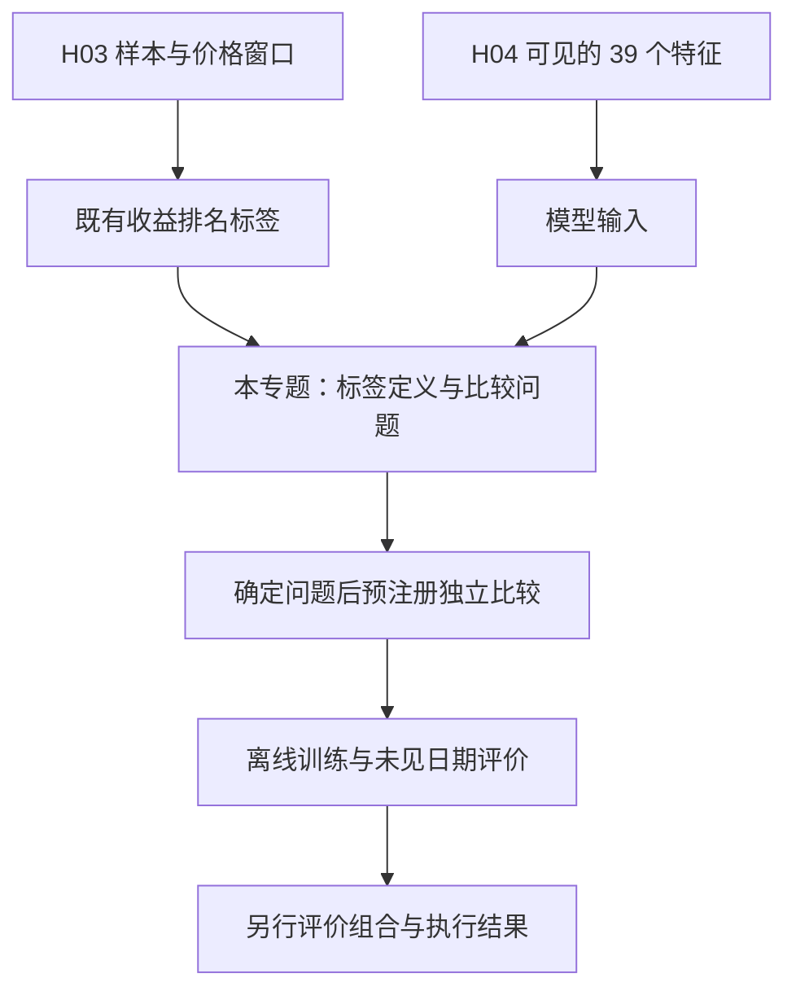

# 股票标签设计与学习目标

- 整理日期：2026-09-16。
- 文档性质：研究思路整理；未合入的工作树版本为 draft。
- 核对基线：本地 `823547a68a65360e4d5679bfeeef4aacc5f6d550` 的相关文档与训练代码。
- 本文拥有本专题的待澄清问题和未来想法，不拥有 H03–H06 的状态、正式数据契约或运行行为。
- 文中数值除明确引用的候选参数及第 24 节用户确认的业务前提外，均为构造示例；没有运行
  数据实验或形成模型效果证据。

## 目标

围绕“一只股票 × 一个交易日 × 当天 14:30 决策时点”的样本，整理标签应当表达什么、模型
输出如何解释、不同标签需要什么数据，以及怎样检验这些目标是否支持预期决策。

重点回答以下问题：

1. 模型是在预测收益幅度、相对强弱、事件概率，还是收益的不确定性？
2. 每天股票数量不同，横截面百分位排名是否仍然有意义？
3. 停牌、新上市、特征缺失、未来退出价格缺失，分别改变什么集合和分母？
4. 哪些目标可以从现有排名标签派生，哪些必须重新构造收益或价格路径？
5. 怎样隔离标签设计、模型选择、数据覆盖和交易执行对结果的影响？

本专题关注标签定义与比较方法。股票 14:30 数据构建、融合、训练和回放链路的实现研究仍由
[原卷宗](../stock-1430/README.md) 记录。两者通过引用衔接，不在本文重复维护其研究状态。

## 当前背景与引用边界

| 事项 | 解释依据 | 本文如何使用 |
| --- | --- | --- |
| 样本身份、Feature universe、VWAP 窗口、收益和排名标签 | [H03 数据契约](../../docs/data/stock_1430_feature_label_contract.md) | 解释核对时已有的候选口径，不自行变更公式 |
| 39 个融合特征、P/T 日期关系和各列排名分母 | [H04 融合契约](../../docs/data/stock_1430_daily_l2_contract.md) | 解释输入可见性、尺度和缺失 |
| 日频原始字段含义 | [日频 Feature/Label 契约](../../docs/data/daily_feature_label_contract.md) | 解释源分区和历史窗口 |
| 价格与复权因子 | [价格复权契约](../../docs/data/price_adjustment_contract.md) | 解释价格口径及其限制 |
| 训练窗口、maturity、固定模型和预处理 | [原卷宗 H05](../stock-1430/README.md#h05) | 作为讨论基线，不替代其 Acceptance |
| 组合构建、执行窗口和未成交 | [原卷宗 H06](../stock-1430/README.md#h06) | 说明预测与交易结果之间的边界 |
| 当前通用训练实现 | [SGD trainer](../../src/training/models/sgd_regression.py) | 只说明核对到的实现事实，不证明 H05 已实现 |
| 研究记录与采用 | [Research 工作流](../../docs/engineering/research_workflow.md) | 决定后续假设、证据和决策的记录位置 |

核对时，H03/H04 数据文档的页首仍标记为拟议 owner。本文引用它们说明已有候选定义；正式
语义及采用情况应以目标分支的 owner 和原卷宗为准，不能由本文或当前代码自行确认。

本次整理属于不改变正式语义的文档维护。本文没有新建独立 Change，没有选择某个新标签，
也没有设置未经讨论的实验日期、通过阈值或生产行为。下文备选设计均属于待澄清问题或未来想法。

## 依赖关系



箭头表达依赖关系，不表达排期、已采用状态或实验成功。新目标若改变 H03 的标签语义，必须
另行确定采用边界；不会因为下游讨论需要，就在既有 `v1` 中悄悄改变定义。

## 关联 Change 索引

- [H03：Feature 与 T+1 VWAP Rank Label](../stock-1430/README.md#h03)
- [H04：日频与 Level2 Feature 融合](../stock-1430/README.md#h04)
- [H05：融合模型离线训练](../stock-1430/README.md#h05)
- [H06：离线回放与受限执行](../stock-1430/README.md#h06)

## 阅读导航

- [1. 样本与输入](#1-样本与输入)
- [2. 当前标签的完整生成过程](#2-当前标签的完整生成过程)
  - [2.5 VWAP 是特征还是标签](#25-vwap-是特征还是标签)
  - [2.6 VWAP 为什么重要](#26-vwap-为什么重要)
- [3. 当前模型学习的统计对象](#3-当前模型学习的统计对象)
- [4. 每天数量不同的排名为什么仍有意义](#4-每天数量不同的排名为什么仍有意义)
- [5. 必须区分的集合与分母](#5-必须区分的集合与分母)
- [6. 停牌与新股如何影响研究](#6-停牌与新股如何影响研究)
- [7. 标签方案总览](#7-标签方案总览)
- [8. 排名回归](#8-排名回归)
- [9. 收益率与成本目标](#9-收益率与成本目标)
- [10. 超额收益与相对基准](#10-超额收益与相对基准)
- [11. 分类与概率目标](#11-分类与概率目标)
- [12. 直接学习排序](#12-直接学习排序)
- [13. 分位数与风险目标](#13-分位数与风险目标)
- [14. 多持有期与路径目标](#14-多持有期与路径目标)
- [15. 输入处理与标签定义的关系](#15-输入处理与标签定义的关系)
- [16. 样本权重与日期权重](#16-样本权重与日期权重)
- [17. 时间可见性与泄漏边界](#17-时间可见性与泄漏边界)
- [18. 不同目标如何评价](#18-不同目标如何评价)
- [19. 如何形成可比较的研究](#19-如何形成可比较的研究)
- [20. 从标签到交易决策](#20-从标签到交易决策)
- [21. 需要用户决定的问题](#21-需要用户决定的问题)
- [22. 常见误解](#22-常见误解)
- [23. 术语与证据边界](#23-术语与证据边界)
- [24. 盘后全市场数据与实时订阅约束](#24-盘后全市场数据与实时订阅约束)

## 待澄清问题与未来想法

### 1. 样本与输入

#### 1.1 一行代表什么

```text
一条样本 = 一只股票 × 一个交易日 × 当天 14:30 决策时点
完整身份 = (symbol, trade_date, decision_ts_utc)
```

`trade_date=T` 是正式交易日，`decision_ts_utc` 是上海时间 `T 14:30:00` 对应的 UTC epoch
microseconds。完整身份用于对齐、分组、回放和追溯。首轮讨论中，股票代码与日期不作为特征。

每个训练窗口内，不同股票、不同日期共同训练一个模型；H05 的每个评价日期再训练一个 fresh
model。因此“共同训练一个模型”指窗口内共享参数，不表示全历史只有一个永不更新的模型。

#### 1.2 输入维度

| 特征组 | 数量 | 表达的信息 | 非缺失值范围 |
| --- | ---: | --- | --- |
| L2 横截面排名 | 28 | 四个窗口的价格、活跃度和成交方向代理 | `(0,1]` |
| 分钟观察比例 | 4 | 四个窗口内实际观察分钟占计划分钟的比例 | `[0,1]` |
| 日频横截面排名 | 7 | 前一交易日分区提供的收益、波动、回撤和活跃度 | `(0,1]` |
| 合计 | 39 | 一条样本的输入向量 | 仍可能存在缺失 |

四个窗口为 5、15、30、60 分钟。融合表共 42 列，即 3 个 key 加 39 个 Feature；模型输入
矩阵只包含顺序固定的 39 列。39 个输入不要求输出也是 39 个数。

#### 1.3 日频日期已经处理过

```text
T = 样本与决策所属交易日
P = T 的前一正式交易日
读取 daily P 分区

P 分区的 close_return_1d / open_gap_1d / log_amount 包含 P 日信息
P 分区带 asof_tminus1 的字段，历史窗口结束于 P 的前一 session
因此这些窗口相对 T 结束于 T-2
```

这里的 `T-2` 是第二个前序交易日，不是自然日减二。训练阶段再整体滞后一次，会改变输入
语义。标签虽使用未来结果，仍与 `T` 的样本 key 对齐，不把该样本改成 `T+1` 的决策样本。

### 2. 当前标签的完整生成过程

#### 2.1 时间线

| 时刻或窗口 | 用途 | 在 T 日 14:30 是否属于已知输入 |
| --- | --- | --- |
| T 日 14:30 之前的可见分钟 | 构造 L2 Feature 与当天股票池 | 是，另需证明实际数据可用性 |
| T 日 14:30 | 产生一次预测与决策 | 决策边界 |
| T 日 `[14:31,14:36)` | 入场参考 VWAP | 否 |
| 下一交易日 `[14:31,14:36)` | 出场参考 VWAP | 否 |
| 下一交易日 14:36 | 当前标签规定的 maturity | 此时未来价格窗口才完整结束 |

所有窗口为左闭右开。`[14:31,14:36)` 包含 14:31 至 14:35 开始的五个计划分钟。
当前候选只要求窗口内至少有一个有效观察分钟，不要求五分钟全部存在。

#### 2.2 先计算参考收益率

```text
entry_vwap = T 入场窗口成交额之和 / 成交量之和
exit_vwap  = T+1 出场窗口成交额之和 / 成交量之和

r(i,T) = exit_vwap(i,T+1) × adj_factor(i,T+1)
         / [entry_vwap(i,T) × adj_factor(i,T)] - 1
```

这是复权价格口径的窗口收益，未扣费用、滑点和冲击。它不是实际订单的净收益，也不能单凭
复权公式证明真实持仓已经正确处理分红、送转和其他公司行动。

入场价、出场价、复权因子及调整后价格必须满足相应有效性要求。某只股票缺少必要值时，
该股票的收益与标签为 null，样本 key 保留。必要的整日输入对象缺失则整体失败，两者不能混同。

#### 2.3 再计算横截面百分位

对 `T` 日 Feature universe 内有效收益集合 `V_T`，记 `N_T=|V_T|`：

```text
y_rank(i,T) = average_ascending_rank(r(i,T) within V_T) / N_T
```

排名从低到高；并列取平均序位；null 不参与分母，也不被填成零或最后一名。
这与 `rank(ascending=True, method="average", pct=True)` 的含义一致。
[pandas 排名说明](https://pandas.pydata.org/docs/reference/api/pandas.Series.rank.html)

| 股票 | 实际参考收益 | 升序序位 | 标签 |
| --- | ---: | ---: | ---: |
| A | +2.0% | 4 | 1.00 |
| B | +0.8% | 3 | 0.75 |
| C | -0.4% | 2 | 0.50 |
| D | -1.5% | 1 | 0.25 |

将所有收益减去 3 个百分点，A 变成 -1.0%，但四只股票的排名标签完全不变。
因此标签保留相对顺序，舍去绝对收益水平及相邻股票的收益差距。

#### 2.4 并列与极小集合

```text
原始值 [10, 20, 20, null]
有效数 N = 3
平均序位 [1, 2.5, 2.5, null]
百分位   [1/3, 5/6, 5/6, null]
```

只有一个有效值时，标签为 1；两个值完全相同时，标签都为 0.75。最大的并列标签不保证为 1。
这些结果符合当前公式，但不代表该日存在有用的排序信息。

对 N 个有效值，平均序位之和始终是 `N(N+1)/2`，因此标签均值为 `(N+1)/(2N)`，而不是
严格的 0.5。N 很大时这个差异很小；小集合不能被当成与大集合信息量相同的横截面。
改成其他百分位公式会改变标签版本，不属于对当前定义的无行为调整。

#### 2.5 VWAP 是特征还是标签

VWAP（Volume-Weighted Average Price，成交量加权平均价）是一种价格计算口径。特征和标签
是它在预测任务中的角色，取决于使用目的、计算窗口和决策时的数据可见性。同一个模型可以
使用过去的 VWAP 构造特征，也使用未来的 VWAP 构造标签。

以 T 日 14:30 决策为例：

| 用法 | 例子 | 角色 |
| --- | --- | --- |
| 描述决策时已经知道的市场状态 | 过去窗口 VWAP 的变化、当前价格相对历史 VWAP 的偏离 | 特征 |
| 描述决策之后发生的结果 | 未来窗口的 VWAP，或用未来入场、出场窗口 VWAP 计算的收益 | 标签或标签的计算原料 |
| 衡量成交质量 | 自己的成交均价与同一窗口市场 VWAP 比较 | 执行基准 |

特征回答“现在有什么信息”，标签回答“后来发生了什么”。如果任务本来就是预测未来窗口
平均成交价，未来 VWAP 本身可以作为标签；当前 H03 的目标则是用 VWAP 计算参考收益，再
学习收益的相对排名。表中的一般用途不表示这些特征或目标都已被当前方案采用。

H03 的特征侧已定义四个历史窗口的首尾分钟 VWAP 变化率，并将变化率做横截面排名。
例如五分钟窗口 `[14:25,14:30)`：

```text
minute_vwap = 该分钟成交额之和 / 成交量之和
edge_vwap_return = minute_vwap(T 14:29) / minute_vwap(T 14:25) - 1
f_l2_edge_vwap_return_rank_5m = 上述变化率在当日 Feature universe 内的有效值百分位排名
```

标签侧使用第 2.1 节的两个决策后窗口，按第 2.2–2.3 节生成 `y_rank_return`。因此模型输入
描述过去的价格变化，监督目标描述未来参考收益的相对强弱。两侧的具体窗口、缺失和排名
规则均引用 [H03 数据契约](../../docs/data/stock_1430_feature_label_contract.md)，沿用本文
开头说明的候选与 owner 边界。

T 日 `[14:31,14:36)` 的入场 VWAP 在 T 日 14:30 仍属于未来信息。把它或当天全日 VWAP
放进该时点的特征，会造成泄漏；“都是当天的数据”不能使其成为已知输入。过去窗口用于
特征时，还需证明数据当时已实际可获得，详见[时间可见性与泄漏边界](#17-时间可见性与泄漏边界)。

#### 2.6 VWAP 为什么重要

**成交量权重让均价反映成交分布。** 对指定窗口内的逐笔成交，且价格、数量单位一致时：

```text
VWAP = Σ(成交价格 × 成交数量) / Σ成交数量
     = 窗口成交额之和 / 窗口成交量之和

构造示例：10 元成交 100 股，11 元成交 900 股
VWAP = (10 × 100 + 11 × 900) / 1000 = 10.9 元
```

这个窗口的大部分成交量发生在 11 元，因而 VWAP 更接近 11 元。单笔小成交对窗口均价的
影响受其成交量占比限制。将分钟数据合成窗口 VWAP 时，同样应先汇总成交额和成交量再相除，
不能直接对各分钟 VWAP 做简单平均。

**参考价格窗口决定模型学习哪种收益。** “今天收盘到明天收盘”和“今天决策后五分钟到
下一交易日同一窗口”是不同目标。更换入场或出场窗口，可能同时改变收益、股票排名、标签
成熟时间和有效样本覆盖。这是 VWAP 在当前标签设计中的直接意义；是否优于其他价格口径
仍需要实验比较，不能由定义推断。

**VWAP 提供执行比较基准。** 可以将自己的成交均价与同一窗口市场 VWAP 比较，观察执行
价格的偏离。IBKR 的 best-efforts VWAP 算法以追踪 VWAP 为目标，其说明也明确指出可能偏离
基准或无法全部成交。[IBKR VWAP 算法说明](https://www.interactivebrokers.com/campus/glossary-terms/vwap-algo-best-efforts/)
因此，标签使用窗口 VWAP 并不保证订单能按该价格成交；实际收益还取决于成交限制、市场冲击
和费用等执行条件。

VWAP 作为价格基准的用途，与它是否提供预测增量需要分别判断。价格高于或低于历史 VWAP，
本身不能推出下一步涨跌；当前特征是否有效，需要在满足历史可见性、未参与选择的日期上
验证。本节只有定义、构造示例和既有候选口径说明，没有运行市场数据实验或形成采用结论。

### 3. 当前模型学习的统计对象

#### 3.1 标签、预测与动作

| 对象 | 含义 | 何时得到 |
| --- | --- | --- |
| `y_rank_return` | 历史样本未来收益的实际排名 | 标签成熟后 |
| `score` | 模型根据当时特征给出的估计 | 决策时 |
| 预测分数的当天排名 | 将当日可预测股票的 score 再排序 | 决策时 |
| 目标持仓与订单 | 结合分数、持仓、现金和约束形成的行动 | 组合与执行阶段 |

预测 `0.73` 不是收益 `+0.73%`，也不是上涨概率 73%。它也不保证股票恰好处在当天预测列表
的第 73 百分位；确定预测列表位置还需要对所有 score 排序。

#### 3.2 线性排名回归

H05 引用的模型为：

```text
SGDRegressor(alpha=0.0005, l1_ratio=0.0, random_state=0)
score(i,T) = b + sum_j w_j × x_j(i,T)
```

按该估计器默认的平方误差和 L2 正则化，优化目标可概念性写为：

```text
平均预测误差平方 + 权重大小的惩罚
```

平方误差的理想统计目标是给定输入后的标签条件均值。这里可理解为“具有类似特征时，未来
相对位置的平均倾向”。有限样本、线性表达能力、正则化和优化过程都会限制拟合结果，不能
把实际 score 当成已经精确求出的条件期望。

输入和标签的范围不会给线性输出自动加边界。score 可以低于 0 或高于 1；为了显示方便而
截断会制造并列，可能改变排序结果，不能默认为无害处理。
[SGDRegressor 官方说明](https://scikit-learn.org/stable/modules/generated/sklearn.linear_model.SGDRegressor.html)

#### 3.3 模型族不等于完整训练过程

核对基线中的通用 `train_sgd_regression` 创建新估计器后调用一次 `partial_fit`。这不能被
描述成已经迭代到收敛的最小二乘解，也不能证明 H05 的三字段 loader、timestamp schedule
和 artifact 已经完成。训练遍数、样本顺序、有效默认参数、库版本和随机性都应进入实际实验记录。

这种线性模型直接学习加性关系。原始 39 列中没有显式的乘积项时，不能把它解释成自动学习了
任意复杂的特征交互。系数的正负也不是因果结论，相关特征之间可能分担或抵消权重。

### 4. 每天数量不同的排名为什么仍有意义

#### 4.1 数量差异可以归一化

| 日期 | 有效股票数 | 升序序位 | 百分位 | 含义 |
| --- | ---: | ---: | ---: | --- |
| T1 | 1,000 | 900 | 0.90 | 在该日集合中约前 10% |
| T2 | 2,000 | 1,800 | 0.90 | 在该日集合中约前 10% |

百分位表示相对于各自集合的位置，不要求集合数量相同。因此股票数随上市、停牌等自然变化，
并不会使计算失去意义。相同百分位不保证相同的收益水平、波动、流动性或投资难度。

#### 4.2 组成差异仍然存在

某股票收益不变，原来在 5 只股票中升序第 4，标签为 `4/5=0.80`。增加一只收益更高的股票后，
它仍是第 4，但标签变成 `4/6≈0.67`。变化来自比较对象，而非自身收益变化。

只知道 N 不足以判断稳定性：同样 3,000 只股票，若行业或市值构成明显改变，参照分布也会改变。
因此可以跨日比较相对位置，却不能宣称通过百分位处理后，各日期的统计分布和经济环境完全一致。

#### 4.3 少量新增对百分位的纯机械影响

在旧股票数 N、旧序位 r 不变的假设下，加入 k 只新股票，其中 a 只排在该股票之前：

```text
旧百分位 q  = r / N
新百分位 q' = (r + a) / (N + k)
0 <= a <= k
|q' - q| <= k / (N + k)
```

这是对无并列情形的直接代数界限，不是实测结论。例如 N=5,000、k=10 时，单纯新增造成的
百分位变化不超过约 0.002，即 0.2 个百分点。该例没有涵盖原股票数值变化、大规模退出、
特征缺失分母变化或行业结构变化，不能拿它证明真实数据中所有股票池变动都可忽略。

#### 4.4 小集合与大量并列

N 越小，无并列时百分位步长 `1/N` 越粗。只有两只股票时，标签只能是 0.5 和 1；它与数千只
股票中的细粒度排序不是同等信息。大量并列也会减少可用的排序差异。

至少需要观察每日 N、不同标签值数量、并列比例及评价有效性。最小 N 和覆盖率阈值应在实验前
确定；本文不凭空设定“少于多少就无效”的新规则。

### 5. 必须区分的集合与分母

| 记号 | 集合 | 由什么决定 | 何时可知 |
| --- | --- | --- | --- |
| `U_T` | Feature 股票池 | T 日 14:30 前的规定成交事实 | 决策时，受实际数据就绪约束 |
| `F_j,T` | 第 j 列有效值集合 | U_T 中该列原始值是否有效 | 决策时 |
| `C_T` | 39 列全部可用于预测的集合 | 当前 `missing=drop` 后的保留行 | 决策时 |
| `V_T` | 未来参考收益有效的集合 | entry、exit、factor 均满足要求 | 标签成熟后 |
| `D_T` | 可训练或评价的完整样本集合 | `C_T ∩ V_T`，另受 maturity 限制 | 标签成熟且可用于该次训练后 |

每个特征排名的分母是该列的 `|F_j,T|`；标签排名的分母是 `|V_T|`。不同特征列之间、特征与
标签之间，都不保证分母相同。观察比例本身不是横截面排名，不使用该排名分母。

例子：

```text
|U_T| = 5,000
|C_T| = 4,400
|V_T| = 4,900
|D_T| = 4,300
```

在该例中，预测时可以保留 4,400 只；评价时有 4,300 只同时具备预测和有效标签。训练使用的
4,300 个标签，仍是在 4,900 个有效收益中得到的排名，不因训练删行而重新定义。

这些比例回答不同问题：

```text
预测覆盖率              = |C_T| / |U_T|
标签覆盖率              = |V_T| / |U_T|
完整样本占股票池比例    = |D_T| / |U_T|
已预测样本可评价比例    = |D_T| / |C_T|
```

该组名称和公式用于讨论报告应区分的口径，不声明它们已经是某个正式报告 schema。分母为零时
比例没有定义，应按所采用的评价契约处理，不能把它记录成 100% 覆盖。

预测时只能使用 `C_T`，不能预先用未来的 `V_T` 缩小股票池。按未来标签是否存在来决定当日
是否出预测，会把未来信息引入决策选择。

### 6. 停牌与新股如何影响研究

#### 6.1 停牌和没有观察不完全等价

当前 H03 依据可见成交事实建立 U_T，不读取停牌表来决定行集合。因此“没有满足条件的观察”
足以使股票不进入 U_T，但仅靠这个现象无法进一步断言原因一定是停牌。

| 场景 | 当前候选处理 | 研究解释 |
| --- | --- | --- |
| 决策前没有符合条件的连续竞价成交 | 不进入 U_T | 排名针对该规则形成的集合 |
| 决策前有成交，部分特征窗口无足够有效值 | 保留 key，相关特征可为 null | 可能在 missing=drop 时失去预测 |
| 入场窗口缺有效价格 | 保留 key，标签为 null | 无法计算规定的参考持有收益 |
| 下一交易日退出窗口缺有效价格 | 保留 key，标签为 null | 不等于收益为零，也不证明持仓可退出 |
| 必需整日数据对象缺失 | 整体失败 | 不能伪装成正常的逐股票缺失 |

不能为了固定 N，用前值、零收益或随意更换退出时间补足样本。每一种替代都会改变经济问题。

#### 6.2 新股的两种影响

第一种影响是股票池构成：新股进入 U_T 后，可能参与某些特征或收益的排名。
第二种影响是历史不足：长历史日频特征可能为 null，使它被当前完整案例预处理剔除。

所以，新股可能参与某列排名或标签排名，却没有最终进入训练。必须按各集合实际计数，不能
笼统地说“模型包含所有新股”或“新股完全不影响模型”。

当前口径没有新增上市天数过滤。若以后决定研究此类过滤，必须说明过滤作用于 U_T、训练集合
还是交易集合，在哪个阶段计算排名，以及上市信息是否在当时可见。这些选择不是等价操作。

#### 6.3 缺失可能带来选择偏差

有效标签只覆盖 `V_T`。如果某类高风险、低流动性或难以退出的股票更容易缺标签，只在 V_T
上评价会遗漏这些情形。这里描述的是需要验证的风险机制，不是对当前数据的实测判断。

保留 null 行有助于计数和追溯，但不会自动恢复缺失收益。缺失样本的真实收益分布不能只靠
“看起来与完整样本相似”证明；分析至少需要说明已知原因、未知原因以及剩余无法评价的范围。

未来退出不可用的结果本身可以成为独立研究目标，但需要明确定义标签和验证方式。把这些股票
直接删除或赋予人为惩罚值，会把两个不同问题混在一起：收益预测与执行可用性预测。

#### 6.4 不用未来信息制造固定股票池

只选择“整个历史期间都有完整数据”或“今天仍上市”的股票，会用未来存续情况筛选早期样本。
若研究确实需要固定起始股票池，可以在研究起点按当时信息确定成员；以后发生的缺失、退出和
不可交易仍需处理，不能保证每天有同样多的有效训练样本。

固定规则与固定数量是不同要求。当前讨论需要前者，并没有证明后者具有业务必要性。

### 7. 标签方案总览

| 标签或目标 | 一条样本的输出 | 需要的标签信息 | 主要回答的问题 |
| --- | --- | --- | --- |
| 收益排名回归 | 一个无量纲分数 | 现有 `y_rank_return` | 未来相对表现如何 |
| 原始收益回归 | 一个收益率 | 原始窗口收益 r | 未来参考收益幅度如何 |
| 对数收益回归 | 一个对数收益值 | 有效价格比或 r | 对数尺度的结果如何 |
| 超额收益回归 | 相对某个基准的收益率 | r 与明确的基准收益 | 相对基准能多获得多少收益 |
| 上涨或超过门槛的概率 | `[0,1]` 内的概率 | r 与预先定义的事件 | 指定事件是否发生 |
| 进入优胜组的概率 | `[0,1]` 内的概率 | 排名与组别规则 | 是否进入当日高排名组 |
| 多类别或有序类别 | 类别概率向量 | 明确的分箱或事件规则 | 属于哪个结果区间 |
| 直接学习排序 | 用于比较的 score | 同日顺序或相关性等级 | 哪些股票应排在前面 |
| 收益分位数 | 多个收益率分位数 | 原始窗口收益 r | 下侧、中位和上侧结果如何 |
| 尾部事件或路径风险 | 事件概率或路径统计量 | r 或完整的对应价格路径 | 严重亏损或途中不利运动如何 |
| 多持有期或多任务 | 多个目标的向量 | 每个目标自己的标签 | 多个不同问题的结果如何 |

“使用什么模型”和“预测什么目标”是两个选择。线性模型可以回归收益，也可以回归排名；
树模型也可以执行这两种任务。仅更换模型名字不会自动改变预测的经济含义。

现有标签表只有三列 key 和 `y_rank_return`。它能支持基于排名的目标派生，不能恢复原始
收益的符号、幅度、共同市场涨跌或路径。需要这些信息时，应由可恢复输入重新计算并设计研究
制品；不能在既有标签版本中直接加入未经采用的新字段或替换标签含义。

### 8. 排名回归

#### 8.1 目标与损失

```text
训练标签：y_rank
模型输出：score
常见训练目标：最小化 (score - y_rank)^2 的平均值，并加入既定正则化
```

它把连续排名位置当成数值目标。预测 0.2 而真实为 0.9，会比预测 0.8 而真实为 0.9 受到更大
惩罚。按平方误差训练，并不等于训练时直接最大化 Rank IC。

#### 8.2 它保留和丢弃什么

| 信息 | 是否由当前排名标签保留 |
| --- | --- |
| 同日有效股票收益的相对顺序 | 保留，受并列处理影响 |
| 股票处于该日集合的大致位置 | 保留 |
| 收益为正还是为负 | 无法仅凭排名确定 |
| 两只股票相差多少收益 | 丢弃 |
| 市场整体上涨还是下跌 | 无法仅凭排名确定 |
| 实际成交能力和成本 | 未定义 |

极端收益对排名误差的影响有界，但这不表示尾部交易风险已经消失。把 -20% 和 -2% 都放在
低排名区域，会压缩其经济损失差异；这是目标选择的代价。

#### 8.3 适合提出什么研究问题

“这些可见特征是否能够预测当日股票池中下一持有期的相对强弱”与该目标一致。
“是否值得在今天承担市场风险”则需要额外信息，因为普跌日仍然有排名最高的股票。

如果模型的全部 score 接近 0.5，但仍存在稳定的排序差异，仍可能具有排序价值；分数看起来
接近不等于没有信号。反过来，分数差异很大也不证明预测准确。

### 9. 收益率与成本目标

#### 9.1 原始收益回归

```text
y = r
示例输出：+0.006，即预计参考收益 +0.6%
```

平方误差对应条件平均收益的统计目标；绝对误差对应条件中位数的统计目标。二者在偏斜分布
下可以不同。因此文档应写清预测的是哪种位置统计量，不只写“预测收益”。

这种目标保留幅度，适合研究收益门槛、成本敏感性以及与风险模型的组合，但不能因单位是收益率
就声称预测已校准。需要检查预测分组的实际平均收益、不同日期的偏差和尾部误差。

若对 r 做截尾、去极值或非线性变换，学习目标也会随之改变。用这些处理改善某个误差指标后，
仍要检查是否抹去了交易上最重要的极端损失。

#### 9.2 对数收益

```text
y_log = log(1 + r)
```

当前有效参考价格比为正，因此对应 r 大于 -1，可以定义对数收益。它与简单收益在单日横截面
中保持相同顺序，但数值损失和跨期解释不同。

即使模型准确估计了 `E[log(1+r) | X]`，`exp(预测值)-1` 也不等于 `E[r | X]`。反变换后的
输出需要按自身统计含义解释，不能直接命名为预计算术平均收益。

#### 9.3 成本后的目标

为一次完整买入和卖出定义的净收益，应基于入场实际总支出与出场实际净回款：

```text
净收益 = 出场净回款 / 入场总支出 - 1
```

“毛收益减往返成本率”只是在相应假设下的近似。实际费用可能依赖订单金额、成交数量、已有
持仓、换手、流动性、市场方向和执行方式。任意给每只股票减一个常数，不会自动得到真实组合
可实现的收益标签。

如果同日每只股票都减去完全相同的固定成本，排序不变。若成本随股票或行动变化，排序才可能
改变；所使用的成本模型也必须成为标签解释与研究证据的一部分。

可以研究固定规模、固定执行假设下的净收益，但必须明确它是一个执行情景。不能把该情景的
标签直接推广到不同资金规模、不同持仓和真实成交条件。

#### 9.4 用当前输入预测幅度的限制

当前 35 个排名特征主要保留相对位置，4 个比例特征描述观察完整程度。不同日期可能具有相似
的排名结构，却有不同的绝对波动和市场涨跌。这个输入可以用于收益回归，但其幅度预测能力
不能由输入已经归一化推出。

若要增加市场状态、原始波动尺度或价格水平，应作为明确的输入变更单独比较，不能同时改变
标签与输入后把所有改进归因于标签。

### 10. 超额收益与相对基准

#### 10.1 共同市场基准

```text
y_excess(i,T) = r(i,T) - b(T)
```

b(T) 必须对应相同的入场和出场时间范围。直接用收盘到收盘的指数收益代替窗口到窗口基准，
会混入不同时间段的市场运动，不能称为完全匹配的超额收益。

预计超额 +0.5% 可以同时对应股票 -0.5%、基准 -1.0%。相对盈利与绝对盈利应分开解释。
另一个可定义的口径是 `(1+r)/(1+b)-1`；它与 `r-b` 数值不同，不能在同一版本中混用。

#### 10.2 一个可以直接推导的等价关系

对于同一天相同有效股票集合，若所有股票减去同一个 b(T)：

```text
r(A,T) > r(B,T)
等价于
r(A,T) - b(T) > r(B,T) - b(T)
```

因此对共同基准超额收益再排名，得到的标签与原收益排名相同。仅做这种变换不构成新的信息。
如果基准缺失导致集合改变，就不再满足相同集合的前提，必须先核对差异来源。

#### 10.3 行业基准或特征调整

不同股票减去不同的行业基准，可能改变顺序。此时模型学习的是在所定义行业参照下的相对表现。
需要说明行业归属的时点、行业内样本集合、基准权重、小行业处理和缺失规则。

对收益做市值或其他暴露调整，同样是在定义新的目标。对输入做中性化与对标签做中性化不是
同一个实验：前者改变模型看到的信息，后者改变什么算作好的结果。

未来实现的基准收益可以作为历史标签的一部分；它不能作为 T 日的已知输入或筛选条件。
历史行业分类和成分股信息也应使用当时可得版本，而非事后修订后的全历史映射。

### 11. 分类与概率目标

#### 11.1 上涨事件

```text
y_up = 1 if r > 0 else 0
输出目标：P(r > 0 | X)
```

这里需要原始收益的符号。`y_rank > 0.5` 表示相对位置靠前，不能替代 `r > 0`。
缺失收益不能被记作类别 0；否则“未知结果”会被错误解释成没有上涨。

#### 11.2 超过门槛的事件

```text
y_hurdle = 1 if r > c else 0
输出目标：P(r > c | X)
```

c 可以是固定收益门槛，或按明确情景定义的门槛。若 c 随股票、日期或仓位变化，需要记录
其公式和在决策时可见的信息。不得看完最终验证结果后移动 c，使分类结果更好看。

#### 11.3 进入优胜组的事件

```text
y_top = 1 if y_rank > 0.8 else 0
输出目标：P(y_rank > 0.8 | X)
```

0.8 仅为解释用的分组例子，不是已采用阈值。这个目标可以由现有排名标签派生，但会把细粒度
顺序压缩成两个类别。0.81 与 0.99 同为正例，0.79 与 0.10 同为负例。

当 N 很小或存在并列时，正例数量不保证严格等于 N 的 20%。如果目标是“精确前 K 只”，就
需要另行决定并列和边界处理；不能用无关的股票代码排序人为制造经济上的优劣。

#### 11.4 多类别与有序类别

可按预先定义的收益区间形成“负向、区间内、正向”三个类别，或者形成多个排名组。输出应是
这些类别的概率向量，例如 `[0.20, 0.35, 0.45]`，并说明各维含义。

普通多类别损失主要区分类别是否正确，不自动体现“错到相邻档”和“错到最远档”的经济差异。
如果要利用类别顺序，需明确相应有序目标和损失；分箱阈值如何确定也是研究的一部分。

#### 11.5 概率需要校准

概率 0.6 的可检验含义是：在一组未参与拟合、预测值接近 0.6 的样本中，事件发生频率应与
该概率相符。单只股票某一次的结果不能验证概率是否准确。

概率校准需要独立于拟合的数据，并遵守时间顺序。类别重采样或类别加权可能改变概率的解释，
不能只根据分类准确率决定概率可用。可检查 log loss、Brier score 和可靠性分组。
[概率校准说明](https://scikit-learn.org/stable/modules/calibration.html)

#### 11.6 胜率与收益幅度

```text
90% 的情形收益为 +0.2%
10% 的情形收益为 -3.0%

平均收益 = 0.9 × 0.2% + 0.1 × (-3.0%) = -0.12%
```

这只是一个完整列明分布的算例。它说明仅预测上涨概率不足以确定期望收益；还需要收益条件
幅度、成本及可能的约束。0.5 不是所有交易决策都适用的概率阈值。

### 12. 直接学习排序

#### 12.1 比较同一组中的股票

在当前单日单决策时点下，同一 T 的股票形成一个比较组。若未来扩展多个决策时点，则分组需
同时包含决策时点，不能把不同机会集合直接放进同一个组。

成对排序的概念目标是：当同组 `r(A)>r(B)` 时，希望 `score(A)>score(B)`。一种示意损失为：

```text
pair_loss = log(1 + exp(-(score(A) - score(B))))
```

该公式说明比较方向，不指定新的生产实现。并列标签、成对抽样、日期权重和大股票池的计算量
都需要定义。不能将跨日期收益高低混成同一天的选股优劣。

#### 12.2 与排名回归的区别

排名回归对数值误差负责；排序学习对组内顺序负责。两者最后都可能输出一个 score，但 score
的标度和跨组可比性不能因此视为相同。排序分数通常不能解释成收益率、概率或精确百分位。

如果策略只使用列表前部，可以研究更重视前部排序的目标。这改变了优化重点，不保证最终净
收益更好，也不保证对低排名股票的评价仍然同样准确。
[XGBoost 排序学习说明](https://xgboost.readthedocs.io/en/stable/tutorials/learning_to_rank.html)

#### 12.3 相关性等级与经济收益不是同一对象

某些排序算法或 NDCG 配置对相关性等级有离散性、范围或 gain 函数要求。不能假设现有连续
`y_rank_return` 可以原样传给任意排序实现，也不能随意四舍五入后声称目标未变。

如果评价重视高收益股票，需明确“高收益”的 gain 定义。把相邻百分位映射成很不同的 gain，
本身就是新的偏好。采用某个排序库、模型或目标仍需独立比较，不由本文引入技术栈依赖。

### 13. 分位数与风险目标

#### 13.1 预测收益的多个位置

```text
Q10(X) = 条件收益分布的第 10 百分位
Q50(X) = 条件收益分布的中位数
Q90(X) = 条件收益分布的第 90 百分位
```

示例输出：`Q10=-2.0%`、`Q50=+0.4%`、`Q90=+2.5%`。若估计与覆盖校准成立，Q10 到 Q90
形成名义上的 80% 预测区间。它不是确定的上下界，也不是“模型均值估计的 80% 置信区间”。

这里的分位数是在给定特征条件下的未来收益分布中定位；横截面排名是在同一天不同股票之间
定位。二者都使用百分位语言，但统计对象不同。

#### 13.2 分位数损失

对目标分位 alpha、预测 q 和真实收益 r，令 `u=r-q`，可使用：

```text
pinball_loss = alpha × max(u, 0) + (1-alpha) × max(-u, 0)
```

不同 alpha 对低估和高估给予不同惩罚。评价时需要同时看分位数损失、区间覆盖率和区间宽度；
任意放宽区间可以提高覆盖，却不一定提供有用的信息。
独立拟合多个分位数还可能出现 Q10 大于 Q50 的交叉问题，应记录发生情况并单独决定处理。
[分位数回归与预测区间示例](https://scikit-learn.org/stable/auto_examples/ensemble/plot_gradient_boosting_quantile.html)

#### 13.3 尾部事件与风险缩放

另一类目标是 `P(r < -d | X)`，即超过预先定义亏损幅度的概率。它需要原始收益；不能通过
“排名最后一组”替代，因为整体上涨时最后一组仍可能盈利。

也可以研究 `r / sigma_asof`，其中 sigma_asof 是在决策时已知、定义明确的风险尺度。它回答
单位事前风险下的收益问题。sigma 的窗口、可见性、有效性和量纲都需要固定；不能随意增加
一个小常数掩盖尺度无效，也不能把未来实现波动率当成当时可知的风险输入。

#### 13.4 单股风险不能代替组合风险

多只股票的收益可能共同波动。即使每只股票都具备分位数预测，也不能直接相加得到组合分位数。
组合风险还取决于持仓权重和股票之间的依赖关系，属于另一层决策问题。

### 14. 多持有期与路径目标

#### 14.1 多个持有期

可以让每条 T 日样本预测下一交易日、第五个交易日等不同退出时点的收益。每个目标都需要
自己的正式交易日解析、退出窗口、有效性规则和完整 maturity timestamp。

更长持有期的标签会使相邻样本共享更多未来价格区间。评价时不能假设这些样本或日期相互独立，
训练净化也不能直接复用单日标签的 `E-2` 结论。

#### 14.2 终点收益与途中路径

两个样本都以 +1% 结束，途中可能分别经历 -0.2% 和 -8% 的不利波动。终点收益标签无法区分
这两条路径。若业务问题涉及止损、资金占用或极端不利运动，就需要额外的路径定义。

可研究的对象包括持有期内相对入场价的最大有利运动、最大不利运动，以及先触及某个上界或
下界的事件。所有价格应使用一致口径，观察起止点、缺失和公司行动都必须定义。

只有分钟 high/low 时，若同一分钟同时触及两个界限，无法仅靠该分钟知道先后顺序。不能选择
对策略有利的顺序补造事实。缺少识别所需数据时，应说明无法判定的范围。

#### 14.3 多任务输出

可将收益均值、上涨概率、下侧分位数等组合成一个向量，也可以分别训练多个模型。这涉及损失
之间的尺度和权重：收益率误差与 0/1 分类误差的数值不可直接视为同等重要。

多任务不保证各输出自动相容，也不保证共享表示提高效果。它需要先明确每个输出解决的独立
问题，再证明联合训练相对对应的单任务基线有价值。

### 15. 输入处理与标签定义的关系

#### 15.1 数值尺度不决定预测目标

输入位于 `(0,1]` 或 `[0,1]`，只是输入的数值表达。它不会迫使输出成为概率，也不要求标签
同样处于该区间。可以用这些输入回归收益、排名或某个风险量。

首轮讨论沿用现有数值尺度和 H05 的 `missing=drop`。是否标准化、去均值、中性化、增加缺失
指示变量或保留原始量，均应依据独立问题比较，不能当作标签设计中自动附带的改动。

#### 15.2 排名不等于中性化

对成交额做排名不会自动消除规模暴露；对波动做排名不会自动消除行业暴露。模型可能通过
这些特征间接学习规模、行业或流动性相关模式。是否需要控制这些暴露，取决于目标。

如果目标是行业内选股，应该明确相应标签和评价参照。不能仅因所有输入已经变成百分位，就
声称模型预测的是行业中性或市场中性的收益。

#### 15.3 变换的拟合边界

依赖历史统计量的变换，例如全局均值、标准差、截尾边界或概率校准，应在允许的训练或校准
数据内确定。使用整个历史包含最终验证期的数据拟合，会让未来影响过去。

按照预定规则，对 T 日决策时已可见横截面做排名，与用未来日期拟合全局变换不同。它仍需
保证成员、原始值和实际到达时间都满足当时的可见性要求。

#### 15.4 三种操作不能混同

1. 对特征排名：改变模型看到的输入。
2. 对收益标签排名：改变模型学习的结果。
3. 对预测 score 排名：把模型输出转换为当天的相对位置。

这三处的集合和分母可以不同。推理中新增第三步，也应明示预测覆盖集合及用途，不因“都是
rank”就认为它与训练标签完全相同。

### 16. 样本权重与日期权重

#### 16.1 样本等权

设一个训练窗口有 D 个日期，第 t 日有 n_t 条训练样本，单条损失为 L：

```text
样本等权目标 = sum_t sum_i L(i,t) / sum_t n_t
```

一天有 5,000 条样本，另一日有 2,500 条时，前者在这个经验损失中贡献的权重约为后者两倍。
百分位标签解决了标签尺度问题，没有自动让每个日期对拟合产生相同影响。

#### 16.2 日期等权

另一种可以研究的目标是：

```text
日期等权目标 = (1/D) × sum_t [(1/n_t) × sum_i L(i,t)]
```

每个日期贡献相同总权重。它可能更贴近“典型一天的表现”，但也会相对提高小样本日期的影响。
没有理由在未定义研究目的前，把某一种权重宣称为必然正确。

实现样本权重时还应固定归一化方式及其与正则化强度的关系。不能把改变权重带来的效果误归因
于新标签，也不能把抽样顺序、训练遍数变化与标签变化混在一起。

#### 16.3 交易选择的数量与比例

固定选前 K 只与固定选前 p% 是不同的组合规则。例如 K=20 时：

```text
可预测股票为 1,000 只：选取 2%
可预测股票为 5,000 只：选取 0.4%
```

两者的集中度、换手和预测尾部要求可能不同。不能为了应对 N 变化，未经决定就把原有 top-K
改成 top-percent；也不能让未来标签是否缺失改变当时用于选择的预测集合。

### 17. 时间可见性与泄漏边界

#### 17.1 未来结果可以成为标签

监督学习需要用后来发生的结果评价过去的决策。标签使用未来价格本身不构成泄漏；关键在于
该标签是否进入了一个发生得更早的训练、预处理、模型选择或决策过程。

可以把未来窗口的结果记在 T 样本上。不能在 T 日 14:30 将其用作特征、选股条件、是否出预测
的依据或尚未成熟训练样本的结果。

#### 17.2 H05 的成熟时间

在 E 日 14:30 进行训练与评价时：

```text
E-1 样本的退出窗口 = E 日 [14:31,14:36)
E-1 标签的 maturity = E 日 14:36
因此 E-1 尚不可用于 E 日 14:30 的训练

E-2 样本的 maturity = E-1 日 14:36
它是当前单日目标按 maturity 判断的最新 eligible session
```

H05 写明使用最近 30 个 eligible sessions，并按完整 timestamp 而非整数日期差排除未来。
跨周末、长假和年度边界都依赖正式交易日历。

#### 17.3 maturity 与真实可获得时间

窗口结束只说明其市场事件已经发生，不自动证明供应商文件已发布、入库已经完成或对应版本
在当时可读。若重建真实历史信息集，还需要实际可获得时间与输入修订情况的证据。

同一个版本名称不能证明 payload 从未被修改。标签可以引用未来持有期内的因子来定义目标，
但特征和训练时可用数据仍必须满足各自的历史可见性，不能用事后修订的历史值替代当时事实
而不说明限制。

#### 17.4 日期划分与组内完整性

同一天的股票具有共同市场环境和标签参照集合。随机按行拆分会让同一日期同时出现在训练与
验证中，不能模拟“只用过去预测未来”的问题。H05 规定同日 symbol 整体进入 train 或 eval。

若持有期变长，应按新的成熟时间重新划分；若有重叠标签区间，还应据实际比较设计处理其依赖。
不能只改 label horizon，却保留原来的 `E-2` 排除规则。

#### 17.5 模型制品也有时间边界

H05 规定最终 artifact 保存最后一个成功窗口的模型及其 fit cutoff。拿这个模型回放 cutoff
之前的历史决策，会把后来训练信息带回过去。历史评价需要每个当时合法的模型，或者严格
限定在已保存模型 cutoff 之后的区间。

### 18. 不同目标如何评价

#### 18.1 目标与指标的对应

| 目标 | 直接评价 | 补充观察 | 单靠直接评价不能证明 |
| --- | --- | --- | --- |
| 排名回归 | 按日 Rank IC、排名误差 | 分组收益、覆盖率、稳定性 | 净收益为正 |
| 原始收益回归 | MSE、MAE、预测分组的实际收益 | 排序、日期偏差、尾部误差 | 可按参考价格成交 |
| 超额收益回归 | 对已定义超额收益的误差 | 基准匹配、暴露与绝对收益 | 绝对收益为正 |
| 概率分类 | log loss、Brier score、校准 | 区分能力、事件基准率、尾部组 | 胜率对应正的期望收益 |
| 直接排序 | 按组排序指标、前部排序表现 | 原始收益、覆盖、换手 | 排序 gain 等于经济收益 |
| 分位数 | pinball loss、覆盖率、区间宽度 | 不同群体的覆盖和交叉 | 极端结果被确定限制 |
| 组合与执行 | 按已定义执行模型的净收益和风险 | 未成交、成本、参与率、容量假设 | 真实生产收益或无限容量 |

这是一组指标选择问题，不是已经新增到 H05 的验收要求。各比较的主指标和通过阈值必须在
最终验证之前确定。

#### 18.2 按日 Rank IC

在当天同时具备预测和标签的集合上，计算 score 与实际结果的 Spearman 排序相关：

```text
IC_T = SpearmanCorrelation(score(i,T), y_rank(i,T)), i in 当日评价集合
```

它检验排序关系，取值范围为 -1 至 1。同一天的样本需要逐行对齐；不同日期可以有不同样本数。
预测或标签为常数时相关系数没有定义，不能将无效评价静默记录为 0。
[SciPy Spearman 说明](https://docs.scipy.org/doc/scipy/reference/generated/scipy.stats.spearmanr.html)

在相同股票集合且保留相同并列关系时，对原始收益和它的排名计算 Spearman，会得到相同的
相关结果。因此 Rank IC 能比较模型产生的排序，却不能单独区分收益幅度是否预测准确。

计算 Spearman 时在评价子集内形成序位，是指标本身的数学步骤；它不等于重写训练所用的
`y_rank_return`。训练标签的原分母与评价指标的有效样本范围应分别记录。

#### 18.3 跨日汇总

应先得到逐日指标，再按预先确定的方式汇总。需要同时保留每日样本数、coverage、缺失原因和
无效日期；不能只展示成功日期的平均值。

日期等权平均与按样本数加权平均回答不同问题。日期之间还可能相关，尤其在重叠持有期下。
不应把成千上万行股票样本全部当成独立观察，直接得到过度乐观的不确定性结论。

需要置信区间或显著性时，可研究保留日期组和时间依赖的估计方法；具体分组、区块长度和方法
应在实际实验方案中固定，本文不指定未经验证的统计设置。

#### 18.4 常数预测与弱基线

排名目标在大横截面中通常以约 0.5 为中心。常数模型可以得到看起来不大的平方误差，但无法
选出相对更好的股票，其 Rank IC 没有定义。因此“回归误差小”与“有选股能力”必须分开判断。

用于比较的简单基线应在看最终结果前确定。现有融合 baseline 的结果，也不能自动证明日频
组带来增量；该问题需要同日期、同口径的去除日频组比较，并报告覆盖差异。

#### 18.5 共同集合与各自覆盖

如果两个方案覆盖不同股票，可以同时回答两个问题：

1. 在双方共同有预测且有标签的样本上，预测本身谁更好？
2. 按各方案真实覆盖范围和决策规则运行时，整体可用性如何？

共同集合有助于控制比较对象，但会隐藏某方案失去覆盖的代价。只看各自集合又可能把群体
差异误当成预测能力差异。因此需要报告集合关系，不能只选择对某方案有利的一种视角。

#### 18.6 分组收益与执行结果

按 T 日预测在当时可预测集合中划组，再在标签成熟后观察结果。若直接先删除未来无标签股票，
再重选当日 top-K，会让未来可评价性影响过去选择。

可以报告组内“收益可观测子集”的表现，但必须同时报告该组的标签覆盖率。对实际交易绩效，
无法退出的持仓需要按执行契约处理，不能通过从均值分母中删除该股票得到成功收益。

### 19. 如何形成可比较的研究

#### 19.1 先固定要回答的问题

不同问题可以独立采用或拒绝，不应合并成一次无边界的“寻找最好标签”：

- 若问题是相对强弱预测，候选之间应有共同的排序评价口径。
- 若问题是收益幅度预测，应有收益单位下的误差与校准评价。
- 若问题是承担成本后的交易价值，应明确组合和执行假设。
- 若问题是尾部风险识别，应定义尾部事件或分位数，并保存漏判情况。

本节列出研究应明确的内容；它不是已注册实验，也不授权自动尝试所有候选后择优。

#### 19.2 一次比较尽量只改变可归因的部分

比较标签时，优先固定样本时间范围、39 列输入、可见性、模型族、预处理及主要评价集合。
若某目标必须使用不同损失或模型，应直接说明比较同时包含这些变化。

例如从“线性排名回归”改成“非线性原始收益回归”，即使结果提高，也不能仅归因于原始收益
标签。要拆解原因，需要事先设计对应控制比较，而不是事后解释。

不要通过删除失败日期、改变缺失口径、调整阈值或缩短困难行情区间来制造更好结果。

#### 19.3 最终验证前必须明确的内容

| 事项 | 需要回答的具体问题 |
| --- | --- |
| 候选范围 | 本次到底比较哪些标签、损失和模型，哪些明确不比较 |
| 选择数据 | 哪些日期用于理解数据、选择设计与确定参数 |
| 最终验证数据 | 哪些未用于上述选择的日期只用于最终判断 |
| 时间划分 | 如何处理 maturity、标签区间重叠和模型 cutoff |
| 有效性 | 最小有效日期、样本数、覆盖和失效判定如何定义 |
| 主指标 | 哪个指标决定结论，哪些只作诊断 |
| 通过或拒绝条件 | 多大差异、何种不确定性和哪些风险可以接受 |
| 停止条件 | 何时结束比较，失败结果如何保留 |
| 实现与输入 | 精确版本、实际内容和运行条件能否恢复 |

这些问题在当前讨论中尚未全部确定，因此本文不创建带空字段的 Change 或 Notebook。形成
可证伪、可独立决定的假设后，再按研究工作流记录其 Scope、Acceptance 和 Next。

#### 19.4 足以恢复一次结果的证据

实际实验至少需要绑定以下会影响结论的内容：

- 精确代码版本及必要的工作树变更；仅有一个分支名不足以恢复代码。
- Feature 和 Label identity、列顺序、全部实际消费的分区及可恢复内容引用。
- 内容摘要、市场日历、复权因子和历史可见性或修订限制。
- 模型全部有效参数、训练遍数、输入行顺序、预处理、权重和随机种子。
- 实际 train/eval schedule、maturity 边界和每个模型的 fit cutoff。
- 运行环境和依赖版本，以及所有成功、失败、被排除日期与原因。
- 评价集合、每个指标分母、汇总权重、成本和执行假设。

内容摘要有助于验证一致性，但没有可恢复的内容位置，不能单独构成可复现证据。

#### 19.5 标签数据和诊断信息的边界

未来研究可能需要查看原始收益、入场/退出 VWAP、各窗口观察分钟数、排名分母、缺失原因等。
这些信息用于解释和审计，不等于应全部新增为模型特征或正式标签列。

尤其不能把未来标签是否有效、未来退出观察数或未来收益排名分母，作为 T 日已知特征。可用
于训练后的质量诊断的信息，不一定可用于决策时预测。

是否持久化这些诊断、放在哪种研究制品、如何与现有版本衔接，应按实际验证需要决定。本文
不新增 schema、不建立候选平台，也不要求为尚未运行的比较生成空制品。

### 20. 从标签到交易决策

```text
T 日当时可见数据
    -> 39 个特征
    -> 模型预测
    -> 当天可预测集合中的比较
    -> 结合现有持仓、现金与约束形成目标持仓
    -> 按执行规则形成成交或未成交
    -> 标签成熟后评价预测，另行核算组合与执行结果
```

将未来收益分箱后命名为“买、卖、持有”，只是给收益类别起了行动名称。是否能卖出取决于
是否有可卖持仓；是否应买入还取决于成本、资金和组合约束。只靠当前 39 列，不能完整描述
这些状态。

若要直接学习仓位或动作，需要明确状态、可行动作、目标和执行反馈。这是比改变一个收益
标签更大的研究问题，不能作为当前监督学习 baseline 的默认延伸。

原卷宗 H06 描述了固定 top-20、资金比例、整手、滑点和受限执行等回放假设。本文通过
[H06](../stock-1430/README.md#h06) 引用它们，不将回放假设升级成真实市场成交保证。

### 21. 需要用户决定的问题

本节保存待澄清问题，不构成已经选定的实施计划。

#### 21.1 首要业务问题

- 当前首先要证明的是相对选股能力，还是绝对收益、超过门槛的概率或尾部风险？
- 最终决策是每天必须选出一批股票，还是允许根据整体机会水平不持仓？
- 只关心排名前部，还是希望整个横截面的预测都具有可解释性？

若首先验证既有 39 列的相对选股能力，H05 的排名回归与这个问题相符。这是目标匹配关系，
不是排名标签已经优于其他方案的实验结论。

#### 21.2 股票池与比较参照

- 接受当前 U_T 的事实驱动定义，还是存在明确业务理由研究其他股票池？
- 是否需要单独观察新股、低流动性、行业或规模群体的覆盖与表现？
- 如果改变股票池，特征排名、标签排名、训练与交易集合分别在哪一步变化？
- 若要求行业内或基准相对表现，行业与基准的历史版本能否恢复？

不能以“每天股票数不一样”本身为理由，自动引入固定数量、上市天数过滤或未来存续过滤。
用户已确认的订阅计数、套餐档位及盘后数据条件见[第 24 节](#24-盘后全市场数据与实时订阅约束)。

#### 21.3 持有期与价格

- 当前 T 至 T+1 的窗口收益是否对应实际想研究的持有期？
- 是否接受只观察到部分计划分钟的参考 VWAP，还是需要研究更严格的窗口覆盖？
- 公司行动、缺退出价格和未成交应在哪个评价层负责？

这些答案可能影响标签版本、maturity、覆盖与执行契约，不能仅修改一个参数后继续沿用旧证据。

#### 21.4 训练与验收

- 日期等权与样本等权哪个更符合当前问题？
- 是否先保持输入、模型和缺失规则固定，只比较标签与对应损失？
- 选择期、最终验证期、最小覆盖、主指标和停止条件是什么？
- 需要多大程度的改善，才值得承担额外数据依赖或实现复杂度？

如果这些问题尚未确定，可以继续补充理解或检查数据质量，但不能据一次有利结果直接采用
某个标签。采用决定仍需遵循所属 Change 与正式 owner 的边界。

### 22. 常见误解

| 说法 | 更准确的解释 |
| --- | --- |
| 每天股票数不同，所以不能做排名 | 百分位处理数量尺度；组成、覆盖和规则仍需检查 |
| 排名 0.9 表示上涨概率 90% | 它表示在定义集合中的相对位置；概率需要事件标签与相应训练 |
| 排名第一就值得买 | 最高排名也可能亏损，还需考虑成本和风险 |
| 标签在 0 到 1 内，预测也一定如此 | 普通线性回归没有自动的输出范围约束 |
| 新股被 missing=drop 删除，就完全不影响模型 | 它仍可能影响某些特征或标签的横截面参照 |
| 训练剩多少行，就用多少行重算标签排名 | 当前标签在既定有效收益集合中计算；重算会改变目标 |
| 没有未来退出价，可以记作收益零 | 未知收益与零收益不同；执行困难应单独处理 |
| 只保留全历史都有数据的股票最公平 | 这可能用未来存续和完整性筛选历史样本 |
| 收益减去市场收益再排名，会产生新信号 | 同日共同基准且集合不变时，排名完全相同 |
| 所有特征已排名，所以已完成行业和规模中性化 | 排名不自动消除这些暴露 |
| Rank IC 提高就说明净收益提高 | 排序相关不包含收益幅度、成本和成交能力 |
| 样本有几十万行，所以验证信息一定充足 | 同日与相邻日期存在依赖，不能把每行都当独立证据 |
| 多输出模型必然比单输出模型信息更多 | 每个目标需要自己的标签、损失和有效性证据 |
| 因为标签使用未来价格，所以监督学习天然泄漏 | 标签是未来结果；泄漏发生在它提前影响训练或决策时 |
| 窗口已经结束，就证明当时已拿到数据 | maturity 与实际发布、入库和可读时间需要区分 |
| 训练成功或文档写完，就等于采用了标签方案 | 采用、实现、合入、发布和部署是独立状态 |

### 23. 术语与证据边界

#### 23.1 术语

| 术语 | 本文含义 |
| --- | --- |
| 横截面 | 同一个决策日期和时点上的不同股票 |
| 序位 | 在一个明确集合内按某数值排序的位置 |
| 百分位排名 | 当前定义下的平均序位除以有效数 |
| Feature universe | 按既定当时可见规则形成的样本股票池 |
| Label | 用后来结果定义的监督学习目标 |
| Score | 模型输出的数值，含义取决于目标和损失 |
| 条件均值 | 给定输入条件时，目标分布的平均值 |
| 条件分位数 | 给定输入条件时，目标分布的指定位置 |
| 校准 | 预测数值或概率与对应实际频率、幅度的匹配程度 |
| Maturity | 一个目标所依赖的结果窗口完成的时间边界 |
| Point-in-time | 按某个历史时刻实际可知的信息重建数据 |
| Coverage | 按明确分母定义的可预测或可评价比例 |
| Selection bias | 因进入样本的机制，使观察群体与目标群体不同 |
| Walk-forward | 按时间推进，只用当时合法的过去数据训练和评价 |
| Rank IC | 预测与真实结果在同日集合中的排序相关 |

#### 23.2 当前整理可以支持的判断

- 可以准确区分排名分数、收益率、概率、分位数和交易动作。
- 可以从公式解释数量变化为何不使百分位失效，以及组成变化为何仍然重要。
- 可以明确当前各集合、缺失分母、标签成熟时间和 P/T 输入关系。
- 可以识别哪些备选目标需要新标签信息、哪些变换在指定条件下等价。
- 可以提出下一次研究必须明确的问题和证据要求。

#### 23.3 当前整理不能支持的判断

- 不能证明任何一列特征有预测价值，也不能证明日频特征具有增量价值。
- 不能证明哪种标签、模型、权重、股票池或持有期最优。
- 不能量化真实数据中上市、停牌、缺失和组成变化的实际影响。
- 不能证明候选链路已实现完整历史可见性、训练复现或真实交易盈利。
- 不能代替采用决定、代码验证、merge、release 或 deploy 的完成证据。

这些限制来自本次没有运行市场数据实验。后续有新证据时，应在对应假设的唯一记录中绑定
准确代码、实际输入和运行条件，并根据影响范围重新判断，而不是直接把解释性示例改写成结果。

### 24. 盘后全市场数据与实时订阅约束

本节汇总 2026-09-16 讨论中用户确认的数据条件、订阅规则及尚待验证的研究方向。它补充本专题
的研究背景，不定义正式数据源 SLA、定时任务或交易行为，不变更 H03–H06 的状态。

#### 24.1 已确认的数据时间与范围

`T` 表示决策交易日，`P = T-1` 表示正式交易日历中的前一个交易日，不是自然日减一。以下时间
均为 `Asia/Shanghai`。

| 时点 | 用户确认的数据条件 | 可支持的研究 |
| --- | --- | --- |
| P 日 21:00 | 获取 P 日全市场 L2 数据及 Tushare 日频数据 | 结合此前历史，研究 T 日股票池与 topic 分配 |
| T 日盘中 | 实时数据仅来自当时有效的订阅；新订阅只接收订阅成功后的消息 | 根据实际收到的 L2 更新入选股票的判断 |

21:00 是数据获取时间。归一化、分钟聚合、Feature/Label 构建和模型训练的完成时间需要分别
记录，不能把获取时间直接当成全部制品可用时间。此处是用户提供的研究前提，没有通过本次
讨论验证历史批次的到齐时间、修订情况或当前调度配置。

选池输入因此可以包含截至 P 的全市场日频及历史 L2，不必被限定为日频模型。历史数据覆盖
全市场不等于 T 日可以实时观察全市场，也不证明所有 L2 数据类型均已具备处理能力：当前
[正式归一化范围](../../docs/data/level2_normalization.md)为逐笔成交，现有
[分钟事实](../../docs/data/level2_minute_contract.md)由逐笔成交聚合。

#### 24.2 已确认的套餐档位、订阅计数与切换规则

用户确认订阅套餐有 50、100、200、300、500 个 topic 等递增档位，更高额度对应更高套餐费用。
实际采用哪个档位、使用多少 topic，需要后续论证，目前尚未选定。此前的 50 个 topic 只是讨论
示例，不是固定实盘上限；本节没有记录具体套餐报价。

每个 topic 计 1 个订阅数。例如，同一股票的 `trans/688111`、`order/688111` 和
`market/688111` 合计占 3 个额度。以下仅以 50 个 topic 演示容量换算：

| 每只股票订阅内容 | 每只占用额度 | 示例：50 个 topic 最多覆盖 |
| --- | --- | --- |
| trans：逐笔成交 | 1 | 50 只 |
| trans + order：逐笔成交与委托 | 2 | 25 只 |
| trans + order + market：逐笔成交、委托与盘口/订单簿 | 3 | 16 只，余 2 个额度 |

可以混合分配 topic，也可以随时更改 subscribe。新订阅不补回此前消息，因此“可以切换”不等于
“可以恢复未订阅期间的连续行情”。实际回放需要记录订阅生效、取消和消息接收区间。

若仍使用既有 14:30 决策及 60 分钟窗口，完整观察需要覆盖 `[13:30,14:30)`，并建立指标所需
前序状态。14:10 才开始接收的股票没有完整的该窗口，不能用盘后全量文件补齐当时输入。
未订阅、接收中断和股票没有成交也不能混为成交量零。该例解释现有窗口的影响，不表示已选定
新的交易时点、补齐规则或缺失处理。

套餐额度约束同时订阅的 topic 数，不规定必须持有的股票数量。订阅预算、持仓所需 topic
如何保留、何时切换、各类 topic 如何分配，以及是否固定日内名单，仍需在具体研究中明确。
此前讨论的“50 只全部订阅 trans、盘前锁定名单”只是一种候选，不能写成平台限制或已采用方案。

#### 24.3 初筛目标与信息边界

初筛需要研究哪些股票值得分配有限的实时观察资源。此前提出的“昨日成交额 Top50”没有经过
效果验证，不作为已确定的默认方案。绝对成交额反映交易规模，并受市值与换手共同影响；它
不能单独证明趋势方向或次日机会。收益、波动、价格位置等日频字段能够用于建模，也不等于
已证明它们具有 alpha 或足以选出重点股票。

可继续研究两个不同目标：根据选池时信息预测目标持有期的机会；或者识别次日采用既定 L2
策略更可能改善决策的股票状态。后者需要先明确下游策略和比较方式，不能假设比直接预测收益
更容易，也不能用事后最优买卖点或全历史回测赢家代替当时可学习的目标。

历史 L2 可以保留日线聚合丢失的盘中过程信息，但这些信息能否跨日有效仍待验证。选池阶段
可以使用已知的 P 日全市场横截面；T 日实时特征不能依赖未订阅股票的当日 L2。改变横截面
参照集合属于特征语义变化，不能把既有全市场排名直接替换成池内排名后继续沿用原模型或证据。

训练可以利用较广的历史样本；验证必须逐日重建选池、topic 预算、接收区间和决策输入。若
初筛由模型完成，历史选池也须使用当时合法的模型与已成熟标签。未来数据可以在成熟后用于
标签和评价，不能提前影响名单、特征或模型拟合。

#### 24.4 待验证问题

- 在目标交易窗口一致时，历史 L2 相对日频信息是否提高次日选池的有效性？
- 在共同日名单上，当日实时 L2 是否进一步改善预测或决策？
- 在不同套餐额度与 topic 组合下，加入持仓、切换延迟、观察窗口、订阅费用和交易成本后，
  整条链路是否仍有价值？增加额度带来的样本外增量是否足以覆盖追加费用？

“已有上升趋势延续”“次日新启动行情”和“既定入场至退出窗口的收益”不是同一个目标；目前
没有因此选定新的标签、初筛规则、订阅额度、topic 组合、交易窗口、模型或量化验收阈值。后续
可执行比较应按研究工作流预先固定候选范围、选择与最终验证数据、指标和停止条件，再记录实验结果。

## 参考资料

仓库内语义与研究依据见前面的“当前背景与引用边界”及“关联 Change 索引”。外部技术资料
于 2026-09-16 核对，用于解释数学、API 与执行基准概念，不拥有本仓库的业务语义：

- [IBKR VWAP Algo (Best Efforts)](https://www.interactivebrokers.com/campus/glossary-terms/vwap-algo-best-efforts/)：VWAP 执行基准与偏离、未完全成交的限制。
- [pandas Series.rank](https://pandas.pydata.org/docs/reference/api/pandas.Series.rank.html)：百分位、并列与缺失处理。
- [scikit-learn SGDRegressor](https://scikit-learn.org/stable/modules/generated/sklearn.linear_model.SGDRegressor.html)：线性模型、损失、正则化与训练 API。
- [scikit-learn 概率校准](https://scikit-learn.org/stable/modules/calibration.html)：概率预测与频率的对应。
- [XGBoost Learning to Rank](https://xgboost.readthedocs.io/en/stable/tutorials/learning_to_rank.html)：按组学习排序及相关分数。
- [scikit-learn 分位数回归示例](https://scikit-learn.org/stable/auto_examples/ensemble/plot_gradient_boosting_quantile.html)：分位数损失、均值与预测区间。
- [SciPy spearmanr](https://docs.scipy.org/doc/scipy/reference/generated/scipy.stats.spearmanr.html)：排序相关与无效常数输入。
