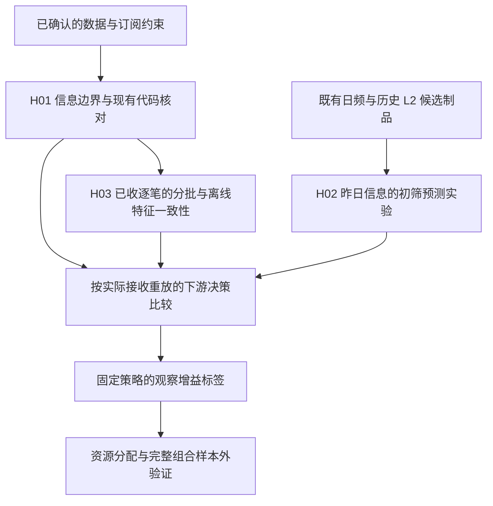

# 有限 L2 订阅下的机器学习训练与实盘对齐

## 目标与当前状态

整理日期：2026-09-19。任务分类：open research。本地 draft；不改变正式 owner、既有
H03–H06、默认入口、模型选择、订阅套餐或真实交易行为。

目标是建立从盘后全市场数据、盘前资源分配、实际收到的盘中信息，到训练、决策、执行和
样本外验证的完整研究方案。最终成功要求信息边界、预测价值、可实现净收益和运行可用性
分别有证据。训练完成、测试通过、正 IC、一次盈利回测均不能代替最终成功。

本专题只拥有这个新研究目标的候选及结论。背景来自
[标签讨论](../label-design/README.md#24-盘后全市场数据与实时订阅约束)、
[假设设计](../hypothesis-design/README.md)及[14:30 卷宗](../stock-1430/README.md)。
研究治理由[research_workflow](../../docs/engineering/research_workflow.md)拥有。

核对工作树基线为 `3f52cd232c7025d414e5ace547c69f8e3afd45c3`，分支
`feature/training_infer`；本地目标分支 `dev` 为 `823547a68a65360e4d5679bfeeef4aacc5f6d550`。
原有 `research/README.md` 修改和未跟踪的 `research/hypothesis-design/` 属于任务开始前的
工作树，不由本研究覆盖。本文后续实验的准确源码和输入以各自归档为准。

已确认：P 为 T 的前一正式交易日；P 21:00 获取全市场历史 L2 与日频数据；实时按 topic
收费/限额，切换不补历史。未确认：交易目标、决策/持有期、资金与风险、套餐及 topic
组合。本文给出候选建议及一个可运行的小实验，不把这些建议写成用户已采用的设计。

## 依赖与研究索引



H01/H02 可以独立判断；它们不是既有 stock-1430 H05/H06 的实现或采用。
尚无充分定义或可用输入的后续环节只列在方案中，不建立空 Change。

- [H01 信息边界的可执行验证](#h01-信息边界的可执行验证)
- [H02 昨日信息能否改善初筛](#h02-昨日信息能否改善初筛)
- [H03 已收逐笔的分批与离线特征一致性](#h03-已收逐笔的分批与离线特征一致性)

## 1. 量化建模首先建什么

先确定研究对象 `(信息 I、可行动作 A、未来结果 Y、效用 U、比较基线 π0)`，然后才选择
机器学习函数。收益来源是可证伪的解释，特征是其可见代理，预测是条件分布的估计，
策略把估计变成行动，执行才把行动变成现金流。五者不能互相替代。

例如，历史成交压力可能帮助识别下一日仍有持续买盘的股票。这只是一条统计假设；
可先比较“日频”与“日频加历史成交过程”对相同未来结果的样本外预测，再检查成本和
成交是否消耗改善。不能把 tick-rule 方向解释成已识别真实主动买卖或资金动机。

推荐顺序是先建立最小可证伪的交易结果预测基线，再研究 L2 的决策增量，最后判断是否
值得另训练订阅分配器。这是降低识别难度的实验次序，不是必须使用两个模型的架构决定。
一个模型、固定资源分配规则、多个模型或最终不交易，都属于可能结论。

### 1.1 预测值得交易

先定义候选入场、合法退出、订单规模、费用与风险边界，监督目标才有经济单位：

```text
r_ref(i,T) = adjusted_exit_reference_price / adjusted_entry_reference_price - 1
μ(I)      ≈ E[r_ref | I]
qα(I)     ≈ conditional_quantile(r_ref | I, α)
```

参考价收益用于学习，实际净损益由成交账本算。若直接构造净收益标签，必须固定订单金额、
执行策略和费用情景；未成交不能悄悄从样本中删除。排名适合候选池排序诊断，但不能单独
决定空仓、仓位、尾部损失或是否能覆盖成本。

“趋势延续”“新启动”“持有期收益”不是三个同义标签。首轮建议用固定可执行窗口的结果，
把趋势/启动状态放入特征及预先约定的分组诊断。若专门研究启动事件，要另定义事件门槛、
起点、路径及触发后的可成交性，不能用未来最低点作为买点。

### 1.2 预测值得观察

设 `I0` 为分配订阅前已有信息；`Zq,w` 是实际获取 topic 组合 q、观察窗口 w 后的新增信息。
固定无新增信息策略 π0、可使用新增信息策略 π1 和效用 U：

```text
V(I0,q,w) = E[ U(π1(I0,Zq,w), Y) - U(π0(I0), Y) | I0 ] - Cobs(q,w)
```

比较的是两个合法策略在同一未来路径上的效用差。π0 允许空仓、用昨日信息交易，也可以
等待到相同决策时点；“无 L2”不能被人为设置成永远犯错。若 π1 因观察而晚入场，等待
损失必须计入。波动、熵、预测残差和教师拟合误差下降只能是候选代理，不是 V 的定义。

一个算例（非市场结果）：昨日信息支持以 +0.4% 条件均值买入；新增 L2 即使更准确，若
行动仍相同，决策增益可能接近零。另一股票的两种可识别情形分别收益 +1%/-1%，先验均值
为零；若 L2 在入场前可靠区分且代价足够小，买/不买可能改善。知道未来涨跌的 oracle
无法用于构造可实现的“完美观察收益”。

资源目标是整个池的条件效用，股票间相关性、现金、持仓和 topic 互补会使价值不相加：

```text
max_S E[U(portfolio_policy using observations S) | I0] - subscription_cost(S)
subject to number of concurrently active (symbol, topic) pairs <= B
```

只有在固定小仓位、可加效用及无组合交互的近似明确成立时，才可按单股 V/topic 排序。
固定套餐价格在已购买额度内不是每增加一个 topic 都产生一笔新的账单；比较档位时再计
入档位费用差，并把闲置额度和机会成本分别报告。

## 2. 从数据到样本的时间边界

### 2.1 必须记录的时钟

| 对象 | 必需的时间与身份 | 作用 |
| --- | --- | --- |
| 离线原始对象 | 市场事件日期、源版本/修订、取得完成时间、内容哈希 | 说明当时拿到哪份数据 |
| processed / feature / label | 输入引用、处理完成、可读时间、计算版本 | 取得时间不等于制品可用时间 |
| 实时消息 | symbol、topic、event_ts、recv_ts、源序号、连接/订阅区间 | 晚到、断流和未订阅不能变成当时已知 |
| 订阅 | 请求、成功确认、生效/取消、断开/恢复、状态初始化 | 额度和实际观察窗口由此推导 |
| 模型 | 训练输入截止、开始/结束、加载可用时间、代码/环境/参数 | 训练截止不是模型就绪 |
| 决策/订单 | snapshot、决策完成、提交、确认、成交及失败时间 | 给计算和执行留真实延迟 |

这些是候选研究记录，不能直接在现有严格 `meta.json` schema 中加字段。正式采用前须
明确新增记录的 owner；通用 Meta 继续只负责其既有对象身份与直接 upstream。

```text
feature.input_available_at <= feature_ready_at <= decision_at
max(label_maturity, label_available_at) <= fit_start_at
fit_end_at <= model_ready_at <= decision_at
subscription effective at receipt; recv_ts <= snapshot cutoff
```

还有一个容易遗漏的条件：过去样本的 X 必须恢复其自身决策时的版本。即使今天已经取得
修订值，训练今天的模型也不能用修订后的 X 假装过去实盘曾看到它。

### 2.2 一天的候选流程

1. P 21:00 开始取得完整盘后输入，逐对象记完成时间；缺必要对象按明确失败规则处理。
2. 归一化、历史聚合、生成截至 P 的特征；新成熟标签独立生成，不进入 T 日特征。
3. 只取在拟合开始前已成熟且已取得的标签，按预定频率训练；保存真实就绪时间。
4. T 盘前产生候选池及 topic 分配；先扣除持仓管理必须保留的额度，再分配探索对象。
5. 发订阅请求，按成功确认后实际消息建立状态；观察不足时不能伪造完整窗口。
6. 到决策点从受限 snapshot 计算特征，用已就绪模型推理，再过组合/风控/执行。
7. 收盘保存消息、状态、决策与订单日志。待结果与数据到齐后评价，供后续预定更新使用。

模型晚于选池截止完成时，本轮信号不能使用它。是否允许使用上一合法模型必须在候选
规则中明确且回放相同；没有规则时停止该轮，不能自动降级成功。

### 2.3 样本与集合

初筛样本建议标识为 `(symbol, trade_date, allocation_ts)`；盘中决策样本为
`(symbol, trade_date, decision_ts, observation_spec)`。在一次固定实验中 observation_spec
可作为数据集版本参数，不需要每行重复存储相同字符串。

分别记录事前候选集合、分配集合、当时可推理集合、实际下单集合、结果可评价集合。
未来无标签、停牌、未成交或无法退出，不得反向改变过去的 top-K；分别报告覆盖及失败。
停牌/ST/上市信息也必须按当时已获得的版本使用，不把 T 收盘后的日对象当 T 盘前信息。

## 3. 数据如何使用与接入训练

### 3.1 离线输入

| 组 | 最小候选内容 | 关键边界 |
| --- | --- | --- |
| 日频 | 收益/跳空、成交额与换手、波动、回撤、价格位置 | P 分区的 `asof_tminus1` 历史窗实际结束于 P-1，不再盲目整体 lag |
| 历史 trans | 历史窗口收益、成交活跃、笔数/粒度、方向代理、观察覆盖 | 全市场 P 横截面可用；不能读取 T 当日信息初筛 |
| 历史形态 | 日内成交分布、早晚盘差异、持续性及跨日变化 | 逐个提出可检验增量，不一开始生产海量因子 |
| 当日 trans | 已收窗口的价格、成交、活跃及变化 | 必须先截消息/初始化状态，再算特征 |
| order / market | 撤单、深度、价差、订单簿等 | 当前未具备正式解析/状态契约，不能把有 raw 文件当作可训练能力 |

本机现有 H03 的 P 日 32 列可作为历史过程信息的第一份代理；它只覆盖 P 14:30 前四个
窗口，不等于已完整利用昨日 L2。第一次比较失败，不能推出全体历史 L2 无信息。

### 3.2 当日特征必须重建

现有 H03 的 28 个排名特征以 T 当日全市场为参照。先对全市场计算再筛订阅名单会泄漏
未订阅股票的信息。把它们直接换成池内排名又会改变语义及选择依赖，原模型不能继续沿用。

首个盘中候选优先使用单股窗口原始比率/变化，并用训练期已拟合尺度归一化；若需要当日
横截面，明确只在当前实际可见池上计算并用历史选池重放训练。跨期基准可使用 P 的全市场
统计，只要其计算与版本当时确已就绪。

当前分钟 `tick_signed_*` 已利用完整逐笔历史计算方向。14:10 才订阅，不能仅裁掉
14:10 之前的分钟而保留原方向状态。要从当时实际消息重新初始化 tick-rule；如果依赖
此前订单簿，只有足够的合法 snapshot/增量序列才能恢复，单纯等 60 分钟不能保证正确。

连续竞价分钟窗口按交易时段推进，午休不算观察时长。区分“已连接且完整观察但无成交”、
“根本未订阅”、“数据丢失”和“状态未建立”。未来数据到达后不能回填改变已经提交的决策。

### 3.3 装配矩阵

1. 先固定事前样本 key，用显式列白名单装配 `X`，身份/未来诊断列不入模型。
2. label 在独立表中以完整 key 对齐，保留原始结果和缺失原因；只有训练/评价阶段读取。
3. 跨日划分 train/select/final；同一决策日全部股票同组，不能随机逐行分割。
4. 在训练行拟合缺失处理、缩放、截尾等状态。缺失指示是否加入也是需冻结的选择。
5. 训练、盘中推理调用同一变换与特征实现；用同一 snapshot 检查输出一致。
6. 保存每次预测和模型引用，再与后来成熟结果连接评价。预测接口不要求存在标签。

数据量大时按日期分区，模型输入使用有限列的 Arrow/NumPy 批次。先记录耗时与内存再
决定优化；不为本轮新增特征平台、通用 DAG 或远端特征服务。

## 4. 怎样训练

### 4.1 先建立可解释基线

至少比较常数/随机期望、固定流动性规则、固定动量/反转规则、正则线性与浅层树。
所有比较使用相同事前集合、日期、结果、可见输入、成本及调参预算。
“昨日成交额 top50”只作需要击败的对照，不作为用户已采用的选池规则。

第一轮输入先固定“日频 D”和“D + 昨日 L2 H”，模型先固定 Ridge 与浅 HistGradientBoosting。
不同时搜索大量标签、窗口、网络结构和资金比例。浅树检验有限非线性交互是否有帮助；
深度序列模型需要额外数据规模与稳定性证据，不能由股票行数多推断有效独立样本多。

按日期等权的平方损失候选为：

```text
L = (1 / D) * Σ_day mean_over_valid_symbols((y - fθ(X))²) + regularization
```

权重归一化与正则化强度一起固定。样本内高拟合不构成优势；用收敛诊断、残差、分组
校准及时间稳定性判断模型具体学到什么，特征重要性只解释此模型，不证明机制。

### 4.2 滚动验证和可用时间

训练窗长度及更新频率也属于候选。先固定一种可复跑规则，例如最近 60 个合法训练日、
每月首个评价日重新训练；本轮较短 L2 历史只足以支持 pilot，不能声称跨多年稳定。

对于 T 盘前预测、T+1 退出的样本，假如标签在 T+1 晚间处理完成，则 E 日盘前最新能用
E-2 样本。这个结论必须由完整时间比较算出，不硬编码日历减二；标签处理晚到会再后退。
长持有期、多事件标签根据实际结果区间排除重叠。选择期最后一个结果若未在最终验证开始
前就绪，不能用于当时选模。

最终验证允许按预先冻结的规则自动滚动更新；过去验证日期的结果成熟后可进入后续拟合。
人不能根据验证累计收益换模型、改窗口或调阈值。若要求“整个验证期从不训练这些结果”，
则使用冻结模型的不同实验，不能混报。

### 4.3 观察价值标签如何训练

只有先有冻结的 π0/π1、动作空间、接收窗口、执行及效用，才能做下面的嵌套过程：

1. 在外层训练区间内部，按时间作多段前向训练/预测；每段的 π0/π1 只由更早且成熟数据拟合。
2. 对该段每个合法样本，在相同未来路径和执行假设上分别运行 π0 与 π1，记录净效用差 ΔU。
3. 保留 π1 没有改变动作、观察失败、未成交、亏损的样本；禁止只保留改善或赢家。
4. 用样本当时的 I0 训练 `g(I0,q,w) ≈ E[ΔU | I0,q,w]`，将 topic 费用按正确档位情景计算。
5. 在外层选择期验证整个“分配—观察—决策”链路，再在未用过的最终区间检验。

不能先在全部历史训练“强教师”，再回头生成全历史 ΔU：教师已经见过被标记日期的未来。
不能把一次实现值 ΔU 当成精确真值；它有噪声、策略估计误差和交易模拟假设。

全量历史 L2 在明确的反事实订阅掩码下，可为可覆盖的股票生成模拟观察，前提是字段、
接收延迟/丢包/状态初始化模型可信。若只有当时被选中的实时日志，未选对象的反事实
不可识别；需要记录有已知选择概率的探索样本，或把结论限制于覆盖区域，不能对零支持
区域直接使用逆概率权重。探索也要占额度并计机会成本，不自动加入实盘。

## 5. 怎样验证整条链路

| 层次 | 可证伪条件 | 不通过时的处理 |
| --- | --- | --- |
| 信息正确 | 篡改未订阅/晚到/未来结果不改变当时预测与名单；晚模型不可用；预算从不越界 | 修复隔离/时钟，原失败保留，重验全部受影响场景 |
| 数据可恢复 | 输入内容、源码、环境、参数、分割和输出可恢复；相同输入可重跑 | 补证据，不能把近似重建说成当时实盘 |
| 预测改善 | 在冻结最终日期优于预定基线，日期相关置信区间支持实质改善 | 保留失败；新主张只能使用新选择流程及未消费验证数据 |
| 决策改善 | 相同候选池下 L2 改善完整净效用；不同选池策略再比较完整资源链 | 不能用 loss/IC 改善代替行动价值 |
| 可交易 | T+1、涨跌停、手数、现金、费用、冲击、延迟、未成交、公司行动和终止持仓都有正确账本 | 简化价格回报不能升级成实盘收益 |
| 运行一致 | 影子运行的实际消息可离线复演，相同快照产生相同决策，延迟满足截止 | 查接收/状态/模型发布差异，再继续影子观察 |

### 5.1 比较矩阵

依次回答三个不同问题，避免同时改变所有环节：

1. 相同未来结果下 D 与 D+H 比较：历史 L2 是否改善初筛？
2. 固定同一名单/时刻/下游规则，对比无当日 L2 与有 L2：新增观察是否改变并改善决策？
3. 固定下游可执行策略，对比规则选池、机会预测选池、观察价值选池：谁更善于使用相同预算？

全市场实时 oracle 只用于诊断可达到的上界，不参加真实可部署候选排名。
套餐 B 和 topic 组合在选择期决策，最终期只确认冻结组合；同股多 topic、持仓预留、
订阅成功延迟及切换的冷启动损失都计入。

### 5.2 指标与不确定性

预测侧保留日期等权 loss/IC、候选池结果富集、各群体覆盖及校准；行动侧保留净损益、
相对基线增量、回撤、尾部损失、成交率、换手、参与率、资金占用、订阅费用和延迟。
单独列出横截面基准收益与市场/行业/规模暴露；不能把普涨当 alpha。

对逐日成对差异作连续日期 block bootstrap，保留横截面与相邻日期依赖；区块长度和重复
次数预先固定，报告适用假设及小样本限制；区间依赖日期序列的弱依赖/局部稳定近似，
不能在明显分布漂移下解释为精确的未来覆盖保证。尝试记录全部保留；不能在多个最终结果中只报
最好一个。股票行数不是独立日期数；几十个验证日不支持长期实盘可靠性承诺。

经济成功条件需要资金规模、成本模型、回撤/仓位限制及最低增量收益先确定。例如
“净增量效用的单侧区间下界大于零，同时满足用户风险限制”是可以落地的形式；当前
缺少这些业务输入，不能随意用 Sharpe>1 或盈利某个百分比替用户作决定。

### 5.3 “失败后继续”的正确执行

技术失败可以在相同验收上修复并重跑。预测失败先定位：信息不可用、目标与动作错位、
信息无增量、模型表达不足、估计方差、成本吞噬，分别提出新的可证伪主张。

本轮先冻结有限的线性/浅树比较，允许在选择期内比较它们；最终验证只打开一次。
若最终失败，不能把同一区间改名为新验证集再反复优化。后续可把已消费区间用于研究，
但需要新的未消费历史/前向数据或预先设计的序贯检验。没有新信息且有限候选耗尽时
停止统计搜索，报告未成功及恢复条件。不存在能够保证某市场必然被模型盈利预测的算法。

## 6. 现有代码逐项怎样适配

下表是候选实施说明，不表示已修改。正式采用每个变更时，须把所属 owner 与实现/证据
同步评审；新的订阅/接收契约目前没有正式 owner，只能先在研究中验证。

| 顺序 | 当前实现 / owner | 必要的最小适配及完成条件 |
| --- | --- | --- |
| 1 | `src/access/meta.py`、`docs/data/storage_layout.md` | 保留现有严格 Meta；在研究记录保存时间/版本/内容快照。拟正式化时确定独立的可用性记录 owner；不能用 mtime 冒充历史发布时间 |
| 2 | `src/data_system/normalize/level2.py`、`level2_normalization.md` | 现有逐笔事实可复用；增加实时来源时显式映射 trans 的字段/单位/顺序及 recv_ts，不把 FTP 序号当本地接收时间；order/market 单独定义状态职责 |
| 3 | `src/data_system/builders/level2_stock_trade_1m.py`、`docs/data/level2_minute_contract.md` | 聚合公式尽量复用；进入公式前限定实际可见事件并正确初始化方向/订单簿；同一已收事件前缀离线与实时相等 |
| 4 | `src/data_system/builders/` 下的 `feature_tushare_daily_basic.py`、`stock_1430.py`、`stock_1430_daily_l2.py` | P 日历史特征可复用；新增受订阅约束的当日特征须新版本，不能覆盖全市场 rank v1；保持完整 key，显式单位、窗口和缺失语义 |
| 5 | `src/training/engines/dataset.py`、`src/training/steps/dataset_build.py` | 当前两 key 对齐不足以验证盘中三 key；训练允许删除无监督目标行，推理必须独立于未来标签存在性；只接受白名单特征，保留覆盖/原因 |
| 6 | `src/workflows/offline_training.py`、`src/training/context.py` | 把日期偏移计划改为候选的 timestamp 可用性计划：训练样本、fit_start、截止、model_ready、decision 全部有明确关系；跨节假日、晚到、长持有期有反例 |
| 7 | `src/training/engines/preprocessing.py`、`src/training/inference_model.py` | 复用唯一 fitted transform 的设计；若增加缩放/缺失指示，应进入同一个推理制品；列顺序及 same-snapshot 一致性不可放松 |
| 8 | `src/training/models/sgd_regression.py`、`src/training/models/catalog.py` | 现有 fresh SGD 只调用一次 partial_fit，不能当收敛基线；先在研究脚本比较明确拟合的 Ridge/浅树，不先扩正式 catalog；锁定 seed、遍数和权重 |
| 9 | `src/training/artifact.py`、`src/training/steps/artifact_persist.py` | 现有只保存末窗口资产与有限 params；回放需每个当时合法模型/更新记录和预测，保存 cutoff/ready/input/code/环境；不能拿最后模型回测更早日期 |
| 10 | `src/trading/market/minute_feature_view.py`、`src/trading/engines/replay.py` | 当前 minute cube 只有事件时间视图，缺订阅/recv/初始化约束；给 signal 注入已裁剪快照，执行模拟另持有未来路径；未来 poison 不影响信号 |
| 11 | `src/trading/backtest/timing.py`、`src/trading/execution/`、`src/trading/portfolio/` | 当前 daily timing 不能证明盘中时序；复用组合/费用职责前核对 owner 与规则版本，补 T+1、限制价格、公司行动、无法退出及终止估值责任 |
| 12 | workflow、CLI、registry | 研究代码不接正式入口。只有用户明确采用且 owner/实现/测试同步后，才按发布工作流接入；发布、部署、实盘启用分别授权和验证 |

这里的文件路径均相对仓库根。既有编排 owner 为
[offline_workflow_contract](../../docs/offline_workflow_contract.md)，现有数据读取边界为
[access](../../docs/engineering/access.md)。`src/` 内不读取本目录，不创建新的通用包装层。

## H01 信息边界的可执行验证

- Status: open。
- Hypothesis: 用完整 key、可用时间和已生效订阅裁剪，可以拒绝晚标签/晚模型、订阅前及
  未订阅信息，并保持合法事件前缀的预测输入不受未来数据改变。
- Why: 当前只基于日期及全市场分钟制品不足以证明实盘一致。
- Scope: 自包含研究反例、现有公开 API 的行为复现及候选边界断言。
- Not included: MQTT 连接、生产代码修复、真实接收 SLA、真实交易。
- Acceptance（运行前固定）: 明确展示现有两 key 接口不验证 decision timestamp；候选
  三 key 校验拒绝错位；晚标签/晚模型拒绝；接收晚到/订阅前/未订阅事件不可见；同股三个
  topic 计三份额度；状态未建立不能冒充完整观察；修改未来结果不改变 top-K；训练期变换
  与推理使用同一状态。所有场景须通过，保留第一次失败。
- 运行前安排: 执行 notebook，明确分开合成边界验证与真实日志验证。

**Evidence（2026-09-19，本地 draft）**：

[`validation.ipynb`](validation.ipynb) 中完整执行了 8 组候选边界断言，均通过；另复现了
现有日频 dataset 接口接受 decision timestamp 不一致的输入。这符合其两 key 的日频
职责，说明它不足以直接承担盘中契约，不能据此宣称已有日频实现有缺陷。

断言覆盖三 key、未订阅/确认前/晚到/未来消息、三个 topic 的计数、标签及模型就绪、
tick-rule 冷启动、窗口中断/状态未知、未来 label 缺失不影响选池、训练期预处理状态。
其中观察窗口与订单簿仅验证可用性谓词；没有执行真实订单簿重建或线上接收。

- Conclusion: 候选信息边界的自包含反例通过；现有生产链路与真实历史接收一致性**未验证**。
- Next: 有实际接收/订阅/处理/模型就绪日志，以及确定的盘中策略后，注册同事件前缀的
  batch/stream 对照和故障复演。没有这些日志，不能把假设到达时间升级为观测事实。

## H02 昨日信息能否改善初筛

- Status: open。
- Hypothesis: 仅用 P 的日频和历史 L2，在固定参考目标下，预注册学习器能相对简单规则
  提高次日候选池的未来相对结果。
- Why: 先检查便于直接验证的机会预测代理，避免先训练没有定义的观察价值目标。
- Depends on: 已有日频输入与 stock-1430 H03 候选特征/标签；不声明上游已 adopted。
- Scope: 固定机会代理和 50 个 trans topic 的诊断情景；只输出预测、名单和未来排名评价。
- Not included: 真实持仓、成交/净收益、观察价值、套餐采用、全日 L2、跨多年稳定性。

### 运行前冻结的实验方案

以下是本轮研究参数，选择依据是已有可恢复数据与有界计算，不是已证明的最优值。
先保存本文的不可修改快照，再读取监督结果和训练。

| 项目 | 冻结值 |
| --- | --- |
| 数据根 | `/home/wsw/app/data`，只读，正式 Meta 边界取得对象；副本写隔离证据根 |
| T 样本范围 | `2025-11-27..2026-08-25` 的所有正式 session；P 必须为上一 session |
| 已知缺口 | `2025-11-25` 两市分钟缺失，H03 `11-24/11-25` 无分区；从 `11-27` 开始使 P=`11-26`，不在运行时跳缺日 |
| 事前集合 | P 日 H03 股票集合，与 P 日日频左连接；不使用 T 日 Feature universe 来选池 |
| 特征 D | base.yml 已选七个日频量，在 P 事前集合内独立百分位化 |
| 特征 H | P 日 H03 固定 32 列，名称加 lag 前缀；不使用 T 日 L2 |
| 标签 | 已有 T 日 `y_rank_return`；T `14:31..14:36` 至 T+1 同窗的参考收益排名，不重排原标签 |
| 可用时间情景 | P 输入及当日到期标签假设于 P 22:00 就绪；每月拟合于首评价日 08:00，09:00 前就绪、09:00 分配；这是情景假设，没有历史日志证明 |
| 训练 | 最近 60 个完整且标签合法的 session；同日整体；每月首个可评价日 fresh fit；推理集合不因未来 label 缺失改变 |
| 预处理 | rank 缺失填 0.5，observed ratio 缺失也填 0.5；不按标签删除推理行；不调预处理参数 |
| 学习器 | Ridge(alpha=100, solver=cholesky)；HistGradientBoostingRegressor(max_iter=100, max_leaf_nodes=7, max_depth=3, min_samples_leaf=500, learning_rate=0.05, l2_regularization=10, max_bins=63, early_stopping=False, random_state=20260919) |
| 输入消融 | 每个学习器分别使用 D、D+H，共四个有限候选；单线程；日期等权样本权重归一到平均 1 |
| 简单规则 | P 成交额大者优先、P 已知 5 日收益动量、反向动量；另报均匀随机选择的解析期望，随机期望不参加最强规则选择 |
| 选池 | 固定 K=50，各方法在事前集合排序；同分按 symbol 升序；只是诊断预算，不选套餐 |
| 选择期 | 训练满 60 合法日后的可评价日，截止 `2026-04-29`；其标签至 `04-30` 晚到齐 |
| 最终期 | `2026-05-06..2026-08-25`；`04-30` 不参与模型选择，因为其标签至 `05-06` 晚才可用 |
| 选择规则 | 选择期 top50 原始标签的缺失下界均值最高的学习器/输入，与最强简单规则比较；完全同分按候选名字排序；在打开最终输出前落盘选择结果 |
| 主指标 | 最终期逐日 top50 平均原标签的候选减规则差；未观察标签以 [0,1] 给保守差界：候选缺失取0、对照缺失取1，仅用于界，不改训练标签 |
| 通过条件 | 至少 50 个最终日；候选及对照 pooled 标签覆盖各≥98%；保守逐日差的均值≥0.02 且 5-session circular block bootstrap 单侧95%下界>0 |
| 不确定性 | seed=20260919，10000 次区块重抽；日期等权；另报 observed-only IC/loss/覆盖，但不能替换主门槛 |
| 冻结更新 | 最终期按相同月度规则使用已成熟过去标签重训，不能由人工查看最终表现改规则；训练最新日期及情景 cutoff 逐次保存 |
| 停止 | 四候选一次选择、最终只确认所选者一次；如失败保留结果，不同一最终集再选第二赢家，不移动门槛 |

标签缺失界仅是有界排名量的敏感性检验，不能为无法成交/退出构造收益；如果缺失对象的
经济结果本来就不可定义，经济层结论仍然缺失。当前原始版本没有可用性历史，故即使
上述统计门槛通过，也只支持该情景下机会代理有证据，不能声明“已与真实实盘对齐”。

训练期全部标签/最终预测均保留；正式最终统计只展示冻结选定候选与对照，不用其他
候选在最终期的收益再次选择。与同模型 D 基线的 L2 增量可另作清楚标记的诊断，不自动
转成另一条经确认的研究结论。

### Evidence 与 Conclusion

**实际输入**：`2025-11-27..2026-08-25` 共 181 个目标日、937,799 个事前股票日样本，
936,127 个可观察标签。P 来自正式日历，初筛不读取 T 日 L2。复制了 1,094 个 payload/Meta
文件，共 336,648,777 字节；两次执行都确认原始文件内容未变。原 `11-25` 缺口没有填充或
自动跳过，实验的显式起点与预注册一致。

**选择阶段**：2026-03-04..2026-04-29，共 40 个日期。下表为 top50 原排名的缺失下界
均值（0..1，**不是收益率**）；完整逐日失败及覆盖保留在证据中。

| 候选 | 选择期平均得分 |
| --- | ---: |
| 浅树 D+H | 0.527944 |
| Ridge D+H | 0.521537 |
| Ridge D | 0.515565 |
| 浅树 D | 0.514364 |
| 昨日成交额规则 | 0.495720 |
| 既有 5 日收益动量规则 | 0.436179 |
| 既有 5 日收益反向规则 | 0.426525 |

因此冻结浅树 D+H 与成交额规则。没有将成交额规则采用为实盘默认，没有在最终阶段换选
其他学习器。选择期中更好的 D+H 不能单独证明历史 L2 的稳定增量。

**最终阶段**：2026-05-06..2026-08-25，共 79 个日期。

| 指标 | 模型 | 冻结规则对照 |
| --- | ---: | ---: |
| top50 可观察子集的平均未来排名 | 0.474077 | 0.499570 |
| top50 标签覆盖 | 99.9241% | 100% |
| 全部可评价股票的平均 Rank IC | -0.029721 | -0.049886 |

主指标采用缺失保守界：平均成对差 **-0.025905**，5-session circular block bootstrap
单侧 95% 下界 **-0.067399**；不满足均值≥0.02 且下界>0 的预设条件。**本轮统计假设
未通过**，没有改变门槛或把它改成成功。这里不能断言所有模型、所有历史 L2 或所有持有期
都无效，也不构成正式 rejection 决定。

事后分期诊断（不用于重新选择）显示，5、6、7、8 月模型的 top50 结果各自均落后于冻结
规则。模型全横截面 IC 相对对照更高，但所选 top50 更差；这为“整体 IC 不能替代初筛
动作验收”提供了本次具体例子。缺标签仅 3/3950 个入选股票日，不能解释主要差异。

**执行与可恢复证据**：

- 计算脚本为 [`validate_training.py`](validate_training.py)，Notebook 为
  [`validation.ipynb`](validation.ipynb)。初次完整运行目录：
  `/home/wsw/app/research-evidence/subscription-training-2026-09-19-wpg08kc6/`。
- 最终源码复跑目录：
  `/home/wsw/app/research-evidence/subscription-training-2026-09-19-po2l15iv/`。
  每个目录都保存计算前的 `preregistered-README.md`、实际脚本、`source.tar`、
  `run.json`、完整 `inputs/`、`input-manifest.json`、`panel.parquet`、拟合参数/日程、模型、
  `selection-frozen.json`、每日期预测、名单与指标及 `final-summary.json`。
- 两次 119 个预测文件、12 个模型、选择结果、最终指标和面板等 **139 个文件逐字节
  一致**，训练日程除实测耗时外一致。第二次只验证复现，不增加独立样本数。
  源码收敛仅涉及 import/格式、显式保持原顺序的列白名单、manifest 类型和
  `min` 替代 `sorted()[0]`，没有改变候选、参数、日期或验收。
- 首次运行的 79 日预测表另以独立 `sort/head/mean` 重新计算名单与主指标，全部一致；
  记录为 `independent-recomputation.json`。输入面板 SHA-256 为
  `11774b1f9e9e33c76ea2817b852febb41a15b3bb116cc7273c3cc193031c11c6`。
- 运行环境：Python 3.13.13，scikit-learn 1.8.0；完整库版本及 lock 文件随证据保存。
  实测单次模型拟合约 0.07..2.90 秒，只是本机这份数据的观测，不是历史训练就绪证明。
- 相关既有训练、H03/H04 builder 和 timing 回归 **101 passed**。首次测试命令误带不存在的
  `tests/trading/market` 路径，未收集测试；修正为实际测试路径后运行上述 101 项，没有
  删除失败断言。研究脚本的 Ruff 0.16.6 格式/lint、Mypy 2.3.1 定向检查通过。
- Notebook 以锁定解释器从头执行两次成功，保留表格和图。初次 HTML 预览遇到浏览器缺少
  共享库，使用已有研究环境的局部 browser libraries 和中文字体继续检查；没有修改系统包或项目依赖。

所有证据至少保留至本专题的用户决定及审查结束。源码与输入副本可用于恢复执行；摘要
用来验证内容，没有用单独 digest 代替可恢复数据。

- Conclusion: 方案与隔离实验可以运行和复现，但冻结的机会预测候选没有通过样本外初筛
  门槛；实际接收一致性、观察价值和净 alpha 均未验证，状态保持 open。
- Next: 保存失败，不把同一 79 日重新命名为最终集。下一轮候选见下节；准备新验证资源
  或真实前向观察后再预注册，不自动上线或自动 rejection。

## H03 已收逐笔的分批与离线特征一致性

- Status: open。
- Depends on: H01 的信息边界；不依赖 H02 预测有效。
- Hypothesis: 先按订阅及接收截止取合法消息，再在每段连续接收内重建 tick-rule，
  可以让分批输入与离线重放得到完全相同的分钟事实，且过去的决策快照不受后续消息改变。
- Why: H01 的谓词反例没有实际运行逐笔至分钟的路径；正式分钟聚合可以复用，但不能
  继承全日 `trade_side` 或在乱序接收时直接按到达顺序计算价格方向。
- Scope: 隔离研究脚本与可执行 Notebook；复用正式 `Access.trades` 和分钟 builder。
  读取 `2026-08-25` 的 `600000`、`000001` 两只股票正成交，检查 `14:00..14:30`。
  只使用实际价格/成交量，接收时间及订阅区间为下述人工情景。
- Not included: 实时供应商字段解析、真实接收延迟、order/market、订单簿、预测价值和实盘部署。
- 运行前固定的情景：普通消息延迟 100ms；乱序情景每第 31 条额外延迟 7 秒；
  `600000` 于 14:01 订阅，`000001` 于 14:05 订阅；断线情景另将 `600000`
  的 14:12..14:13 标为不可接收，恢复后重新初始化。接收区间左闭右开，禁止补回此前事件。
  在 14:04、14:10、14:14、14:20、14:30 取快照，观察窗为此前 5 个完整分钟；
  这是技术反例窗口，不替用户选择交易窗口。分钟内按事件时间及原序号重排已收消息；
  首笔方向为 0，同价为 0；后到消息可改变以后快照，但不回写过去已提交快照。
- Acceptance（计算前固定）：三种情景 × 两只股票 × 五个截止时点，分别用 1、17、257
  行消息批次产生快照，均须与独立裁剪的离线参照完全相等；独立核对已收成交笔数、量额；
  笔数/成交量精确相等，金额守恒与独立求和比较使用 `rel_tol=1e-12, abs_tol=1e-7`，
  只容纳浮点加法顺序误差，批处理与离线表本身仍须完全相等；
  未收/订阅前消息污染不得影响快照；全日方向字段污染不得影响重新初始化后的结果；
  用确定性小反例证实直接继承方向和按到达顺序定方向会失败；断线后的连续覆盖不足必须
  可识别，不能宣称已完整观察 5 分钟。
- Stop: 一致性失败则保留输入和反例，修复候选实现后在相同验收重跑；不接触 H02
  冻结预测或改动 alpha 门槛。通过也只证明这组已收消息情景下的技术一致性。
- Evidence（2026-09-19）: [`reception_validation.ipynb`](reception_validation.ipynb)
  已从头执行；候选计算为 [`validate_reception.py`](validate_reception.py)。归档目录为
  `/home/wsw/app/research-evidence/subscription-reception-2026-09-19-nqemd547/`，保留运行前
  README、源码、环境 lock、输入逐笔子集、来源 Meta、假设消息、30 份快照和逐项结果。
  `600000` 为 6,210 笔，`000001` 为 7,944 笔，共 14,154 笔；90 次分批/离线对照完全
  相等，独立笔数/量额守恒、未收消息及既存方向污染、过去快照不变检查均通过。
  确定性反例中，继承全日方向使首个观察分钟的有符号成交量从正确的 -100 变为 0；
  到达顺序计算方向也产生不同结果。断线恢复后的 14:14 快照正确报告连接未覆盖完整 5 分钟。
  相关既有分钟 builder 测试 **11 passed**；脚本 Ruff 格式/lint、Mypy 定向检查通过。
  再从归档逐笔子集恢复执行，90 项结果相同，6 份假设消息和 30 份快照共 36 个 Parquet
  文件逐字节一致，记录见归档 `recovery.json`。Notebook 的 5 个代码单元均有执行输出，
  HTML 的中文、对照表和覆盖表已渲染检查。证据至少保留至本专题的用户决定及审查结束。
- Conclusion: 该研究实现验证了这些假设接收情景下的同前缀一致性；分钟公式可复用，
  接收裁剪、区间重置及事件排序必须在其前完成。结果是有独立快照身份的研究输出，不能
  写入或冒充正式全日 `sh_stock_trade_1m/v1`、`sz_stock_trade_1m/v1` 对象。
  研究实现缓存已收前缀并在截止点重算，尚未证明生产吞吐、内存上限或故障恢复性能。
  真实接收、供应商字段映射、订单簿、预测价值和净 alpha 仍未验证。
- Next: 获得实际订阅/消息日志后，在相同消息前缀上核对线上输出与离线重放；先固定
  供应商字段、乱序/丢包/重复和恢复规则再扩大验收。交易目标确定且有新验证数据后，
  才能把该候选消息边界接入完整的训练—分配—决策实验。

## 7. 失败后继续研究的具体方向

这次最直接排除的是“用最近 60 日拟合既有 P 14:30 特征，再固定取 top50，就已经有稳定
初筛改善”的主张。当前证据没有识别失败的唯一因果原因，下面是需要继续验证的想法。

| 新主张 | 怎样训练与对照 | 验证需要补什么 |
| --- | --- | --- |
| 目标更贴近最终行动时，改善能转成可实现效用 | 固定交易窗口/订单规模后，比较参考收益均值与尾部风险目标；先在相同输入、相同执行规则下对照原排名目标 | 用户的交易/资金/风险边界，原始收益、成本与成交/未成交处理；新验证区间 |
| 昨日更完整的成交过程有额外信息 | 固定模型及目标，只将 P 14:30 四窗口替换/增补为预注册的全日成交形态，比较增量 | 对应版本的可恢复特征和新未消费 L2 日期；不能改 v1 含义 |
| 只有某些事前状态值得分配 L2 | 冻结合法 π0/π1，通过内层前向预测生成 ΔU，训练 I0→ΔU，再检验相同预算的完整链路 | 实际/可信模拟的接收与初始化，固定策略及足够日期；仅历史排名标签无法生成 ΔU |
| 当前短样本不足以稳定估计 | 预注册训练窗/更强收缩的有限比较，或先用较长日频历史验证其对应目标 | 日频长期实验只能验证日频目标；不能用它冒充相同 14:30 L2 实盘实验的通过 |

可立即进行的进一步检查已完成：逐日预测独立重算、标签覆盖检查、按月稳定性诊断和完整
复现。它们支持保留失败，不支持再从这次最终结果挑另一模型。继续确认性实验所缺的
不是多运行几遍优化器，而是新的验证信息及明确的下游行动定义。

截至 2026-09-19，本机日频事实虽更多，但同一 L2 研究范围的最终区间已经消费；早期零散 L2 日期不足
本次 50 日门槛，`2026-08-25` 之后也没有足够同口径 Feature/Label。可以继续探索，却
不能诚实地承诺“不断换方案一定会验证出 alpha”。实际接收日志、时间就绪记录及资金/
风险约束已在任务中请求补充；收到后才能完成相应的实盘验证。

### 2026-09-21 新增数据接入检查

用户说明 L2 已更新至 9 月 17 日后，按正式日历和 Meta 重新核对当前文件。代码基线为
`82999e8bd4a6be15ac5070db6247cf976795bb04`；新增 SZ `181001..181999` 的 fund
分类，不改变 stock 特征公式。原实验 1,094 份输入摘要逐个相同；新检查不替换原证据。

初次检查发现原始成交与部分下游最晚到 `2026-09-18`，但 `2026-09-17` 缺 SH
标准化逐笔、两市分钟及 H03 Feature；T+1 Label 最晚到 `2026-09-15`。
`2026-08-26..2026-09-18` 共 18 个 session，不能仅凭最大日期宣称连续完整。

本轮计算前固定范围：在隔离研究存储复制已提交 raw/processed 输入，调用现有正常化、
分钟及 Feature/Label builder 重建 `2026-09-17`，并生成 `09-16/09-17` 的 T+1
Label；原始对象保持只读。检查新增 Feature 的 schema、三 key、决策时间与数值域，
以及完整日期覆盖。成功条件是正常化及既定 builder 全链完成、完整两市输入与 schema/key
校验通过；失败则保存原错误，不改市场时段或证券分类来绕过失败。不读取新增区间的
模型评价结果、不训练选模、不移动 H02 门槛；本轮只判断能否安全接入后续独立验证。
真实接收/就绪记录及经济交易约束仍是独立缺口。

## 8. 复跑与证据检查

在本次相同代码树及项目锁定环境下，可以直接使用已复制输入复跑，不需要生产凭证或
重新访问供应商。下面命令创建新的隔离证据目录，不覆盖已有结果：

```bash
cd /home/wsw/app/dev/trading
.venv/bin/python -B - <<'PY'
from pathlib import Path
import runpy

source = Path('/home/wsw/app/dev/trading')
driver = runpy.run_path(str(source / 'research/subscription-training/validate_training.py'))
evidence = driver['run_research'](
    source_root=source,
    storage_root=Path('/home/wsw/app/research-evidence/subscription-training-2026-09-19-po2l15iv/inputs'),
    evidence_parent=Path('/home/wsw/app/research-evidence'),
)
print(evidence)
PY
```

若当前代码树已变化，先在独立的本地 checkout 恢复记录中的基线 commit，再解开
`source.tar` 覆盖这个独立 checkout 的运行文件，并将归档的 `validate_training.py` 和
`preregistered-README.md` 放回该 checkout 的 `research/subscription-training/`；以它
作为 cwd 和 source_root，从保存的 `inputs/` 执行。不要覆盖正在工作的仓库或正式数据。
依赖按归档 `uv.lock` 恢复；Notebook 的 kernel 必须指向对应 Python 3.13 锁定环境。

检查 `input-manifest.json`、模型和预测内容、`fit-schedule.json`、`selection-frozen.json`
与 `final-summary.json`。逐次 wall time 可以变化，候选、输入、训练日期、预测和主指标
必须一致。所有复跑都是同一实验的恢复，不是新的样本外成功机会。

## 外部方法依据

下列资料用于核对方法，不拥有仓库正式语义，也不证明本市场存在 alpha：

- [scikit-learn 时间序列交叉验证](https://scikit-learn.org/stable/modules/cross_validation.html#cross-validation-of-time-series-data)：未来不能参与过去的模型拟合；本方案进一步处理日期组及标签可用时间。
- [SGDRegressor API](https://scikit-learn.org/stable/modules/generated/sklearn.linear_model.SGDRegressor.html)：partial_fit 一次不是收敛保证；实际实验锁定本机 1.8.0，不用网站最新版本替换环境。
- [The Probability of Backtest Overfitting](https://www.davidhbailey.com/dhbpapers/backtest-prob.pdf)：反复选择历史最好结果会污染验证；本文使用有限候选与冻结最终期。

## 设计、实现与外部状态

设计：研究候选。工作树：本地研究草案及隔离实验。未授权采用任何策略或套餐。
本轮未执行 commit、push、merge、release、deploy、真实 broker、订阅 API 或正式数据写入。
未实测的市场规则、费用和生产接收行为，不能由本文推断已经通过。
