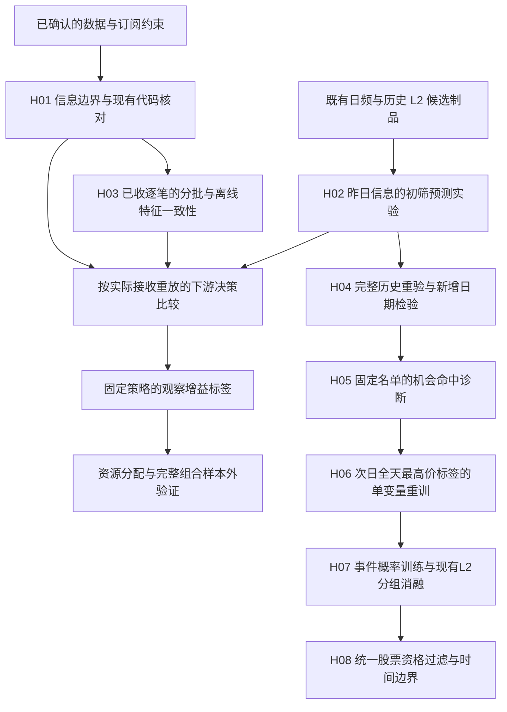

# 有限 L2 订阅下的机器学习训练与实盘对齐

## 目标与背景

研究始于2026-09-19：在有限实时 L2 订阅下，检验昨日信息能否改善盘前选池，并为后续
“分配—观察—决策—执行”验证建立信息边界。本卷宗保存候选及结论，研究治理见
[research_workflow](../../docs/engineering/research_workflow.md)；正式语义仍由 `docs/` owner 拥有。
背景见[标签讨论](../label-design/README.md#24-盘后全市场数据与实时订阅约束)、
[假设设计](../hypothesis-design/README.md)及[14:30 卷宗](../stock-1430/README.md)。

已确认：P 为 T 的前一正式交易日，P 21:00 获取全市场历史 L2 与日频数据；实时订阅按
`(symbol, topic)` 收费/限额，切换不补历史。交易目标、决策/持有期、资金与风险、套餐及
topic 组合仍待定。信息正确、预测改善、可实现净收益和运行可用性须分别验证。

先通过下列索引定位假设，再按 Evidence 读取对应 Notebook 的说明单元。需要复现时使用
说明中绑定的冻结版本；当前文件与历史归档的代码、输入不能互相替代。读取方式见
[研究工作流](../../docs/engineering/research_workflow.md#写入与按需读取)。

## 依赖与研究索引

H01/H02 可独立判断，且不是 stock-1430 H05/H06 的实现或采用。尚未形成可执行假设的
后续环节只保留为研究方向。

- [H01 信息边界的可执行验证](#h01-信息边界的可执行验证)
- [H02 昨日信息能否改善初筛](#h02-昨日信息能否改善初筛)
- [H03 已收逐笔的分批与离线特征一致性](#h03-已收逐笔的分批与离线特征一致性)
- [H04 完整历史重验与新增日期检验](#h04-完整历史重验与新增日期检验)
- [H05 固定名单的机会命中诊断](#h05-固定名单的机会命中诊断)
- [H06 次日全天最高价标签的单变量重训](#h06-次日全天最高价标签的单变量重训)
- [H06 补充：重训改善原因、L2 局限与后续研究方向](#h06-cause-l2-diagnostics)
- [H07 事件概率训练与现有L2分组消融](#h07-事件概率训练与现有l2分组消融)
- [H08 统一股票资格过滤与时间边界](#h08-统一股票资格过滤与时间边界)

## 共同研究边界

预测改善、实际接收一致性、观察价值与可实现净收益分别验证；价格或排名代理不证明成交。
选池只用决策时可见的信息，未来标签缺失不改变推理候选；预处理、拟合与模型就绪遵守当时
的时间边界。历史修订数据与假设接收时间不能冒充当时实际可得的版本。
按完整日期区分开发与最终验证；已查看区间的复跑、修复和补录不增加独立确认次数。
共同方案、时钟约束、样本定义及早期接口核对见
[原研究边界](validation.ipynb#research-boundaries)，L2 覆盖见 [H06 核对](next_day_high.ipynb#h06-l2-coverage)。
正式编排仍以 [offline_workflow_contract](../../docs/offline_workflow_contract.md) 为准。

## H01 信息边界的可执行验证

- Status: open。
- Hypothesis: 完整 key、可用时间及生效订阅裁剪可拒绝不可见信息，并保持合法事件前缀
  不受未来数据改变；现有日期/全市场分钟视图不足以证明这一点。
- Scope: 自包含反例、现有公开 API 复现与候选断言；不含 MQTT、生产修复、真实 SLA 或交易。
- Acceptance（运行前固定）: 展示日频两 key 接口不验证 decision timestamp；候选三 key
  拒绝错位；拒绝晚标签/晚模型及未订阅/确认前/晚到消息；同股三 topic 占三份额度；
  状态未建立不能冒充完整观察；未来 label 缺失不改变选池；训练/推理复用预处理状态。
- Evidence（2026-09-19，本地 draft）: [`validation.ipynb`](validation.ipynb) 的8组断言全部
  通过，覆盖冷启动、窗口中断和未来污染。两 key 行为符合现有日频职责，不构成其缺陷。
  观察窗口/订单簿只验证可用性谓词；源码及恢复基线见 H02 归档。
- Conclusion: 自包含边界反例通过，生产链路、订单簿重建与真实历史接收一致性未验证。
- Next: 获得实际接收、订阅、处理及模型就绪日志和确定的盘中策略后，验证同事件前缀的
  batch/stream 输出及故障复演；假设到达时间不能升级为观测事实。

## H02 昨日信息能否改善初筛

- Status: open。
- Hypothesis: 仅用 P 的日频及历史 L2，预注册学习器能相对简单规则改善次日池的未来排名。
- Depends on: 日频输入及 stock-1430 H03 候选特征/标签，不声明上游已 adopted。
- Scope: 固定机会代理和50个 trans topic 的预测/名单诊断；不含真实成交、净收益、观察
  价值、套餐采用、全日 L2 或长期稳定性。
- Acceptance: 至少50个最终日、两方 pooled 标签覆盖各≥98%、保守均值差≥0.02，且
  5-session circular block bootstrap 单侧95%下界>0；完整参数与停止条件见冻结方案。
- Evidence: [冻结方案与停止条件](validation.ipynb#h02-protocol)、
  [79日失败结果及冻结归档](validation.ipynb#h02-evidence)、[精确复跑](validation.ipynb#h02-reproduce)。
- Conclusion: 实验可运行及恢复，冻结候选未通过样本外初筛门槛；这不构成所有 L2 无效
  或正式 rejection。实际接收、观察价值及净 alpha 未验证。
- Next: 后续历史扩展、命中诊断和目标变更分别见 H04–H06；已消费79日只可用于开发，
  新的确认性主张须预注册并使用未消费信息。

## H03 已收逐笔的分批与离线特征一致性

- Status: open。
- Depends on: H01 信息边界，不依赖 H02 预测有效。
- Hypothesis: 按订阅/接收截止裁剪，在连续接收段内重建 tick-rule，可使分批输入与离线
  重放的分钟事实相同，且后续消息不改变过去快照；不能继承全日方向或按到达顺序定方向。
- Scope: 复用 `Access.trades` 和分钟 builder，隔离检查 `2026-08-25` 的600000/000001
  正成交及 `14:00..14:30`；价格/量真实，接收/订阅为人工情景。不含供应商实时解析、
  真实延迟、order/market、订单簿、预测价值或部署。
- Acceptance: 固定情景的分批/离线事实一致、守恒及污染反例通过；批次、容差和
  截止点按[原验收条件](reception_validation.ipynb#h03-scenarios)，不改变既定精度。
- Stop: 技术失败保留并同验收重跑，不改变 H02 的预测或 alpha 门槛。
- Evidence: [人工接收情景](reception_validation.ipynb#h03-scenarios)、
  [90次对照、反例及归档恢复](reception_validation.ipynb#h03-evidence)。
- Conclusion: 假设接收情景下同前缀一致性成立；裁剪、重置与事件排序须在聚合前完成。
  研究实现缓存前缀并重算，未验证生产吞吐/内存/恢复、真实接收或经济价值，其输出不能
  冒充正式全日分钟对象。
- Next: 取得实际日志并固定字段、乱序/丢包/重复/恢复规则后复演；交易目标及新验证数据
  就绪后再接入完整训练—分配—决策实验。

## H04 完整历史重验与新增日期检验

- Status: open。
- Depends on: H02 的样本、目标及算法，以及9月21日数据接入/发布。
- Hypothesis: 完整可用历史中有限比较 last60/expanding，再冻结配置检验新增17日，
  能判断训练窗是否改善初筛；H02 的50日门槛不作为停止后续研究的通用条件。
- Scope: 用户要求的隔离重训、预测和统计；沿用39列、K=50、14:30参考标签，不含新特征、
  观察价值、真实接收、成交账本或净 alpha。
- Acceptance: 输入/时序/推理一致性和旧预测恢复通过；新增两方覆盖各≥98%、保守均值
  差≥0.02且单侧95%下界>0时，仅称17日短期支持；没有新增50日硬门槛。
  修复重验沿用 H05 的均值差>0且5日区块单侧95%下界>0，仅作探索性支持；
  工程验收及两组各执行一次的停止条件见 [2026-09-22 方案](revalidation.ipynb#h04-protocol-20260922)。
- Evidence: [原冻结方案](revalidation.ipynb#h04-protocol-20260921)、
  [原结果](revalidation.ipynb#h04-evidence-20260921)、[修复重验](revalidation.ipynb#h04-evidence-20260922)。
- Conclusion: 扩展训练窗改善旧开发段模型排名，新增段点估计略正但未通过预设条件；
  H02 失败保留，不自动采用/拒绝模型。
  修复及增加更早历史后，原主候选后续17日命中为38/850与34/850，成交额为146/850，
  固定模型仍未通过机会命中条件；修复未产生新的独立最终验证集。
- Next: 目标/特征新主张可在已看历史开发，独立确认须用新验证信息或预先设计的检验程序，
  原17日不得再次称为未见最终集。事件目标与收益、风险及观察价值的关系仍须明确。

## H05 固定名单的机会命中诊断

- Status: open。
- Depends on: H04 冻结面板、预测、名单和选择。
- Hypothesis: 平均排名接近0.5仍可能富集前部机会；固定名单的 Precision@K/Lift 可直接
  检验，Recall/F1 补充覆盖。用户于2026-09-22同意按机会命中评价。
- Scope: 原102日开发段与17日后续段只读补算，不重训或改名单/策略；结果后的质量补查
  另读六个正式对象并隔离复制。不含分类训练、原始/净收益标签、观察价值、真实接收及成交。
- Acceptance: 名单、计数、缺失边界及执行检查按[冻结方案](opportunity_metrics.ipynb#h05-protocol)；
  主差均值>0且5日区块单侧95%下界>0，至多称探索性支持；两段已查看且未校正多重比较。
- Stop: 固定范围补算一次；技术错误同口径修复，不随结果调整 K、阈值或候选。
- Evidence: [指标及验收](opportunity_metrics.ipynb#h05-protocol)、
  [原结果、质量补查与归档](opportunity_metrics.ipynb#h05-evidence)；修复后重验见 H04。
- Conclusion: 命中指标提供了平均排名之外的重要信息：H04 原主候选未能富集前10%收益
  机会，当前八候选在开发段也未显示该目标的机会密度优势。训练时优化排名回归与评价时
  捕获尾部事件是不同目标；这解释了为何需要另提事件概率候选，但不是已经验证的失败机制。
  用户同意执行指标研究，不表示已采用机会标签、K、模型、交易策略或套餐。
  H05 保持 open；H04 的冻结选择与失败记录保留，经济解释受新增质量发现限制；
  净 alpha 和观察价值未验证。
- Next: 修复重验见 H04；旧重复文件的生成或转存环节仍待追溯。原计划的事件概率有限
  对照已形成 H07，泛化仍须新验证信息；交易机会和观察价值须先明确执行、成本、风险及有/无L2策略。

## H06 次日全天最高价标签的单变量重训

- Status: open；本地 draft。
- Depends on: H04/H05 的修复后冻结面板、训练方案和命中指标。
- Hypothesis: 保持买入基准、特征与训练方法不变，将退出参考价改为下一交易日全天
  最高成交价后，重训模型可以更好地捕获当日横截面前10%收益机会。
- Scope: 只读既有输入，在隔离研究目录生成候选标签、模型、预测与评价；正式标签仍由
  [`stock_1430_feature_label_contract.md`](../../docs/data/stock_1430_feature_label_contract.md)
  拥有，当前候选定义和结论由本段拥有。
- Not included: 改为分类器、新特征、调参、重新选择主候选、卖出时机预测、成交可行性、
  成本或实盘收益；不发布新正式 Label、模型或运行入口。
- Acceptance: 输入、标签边界、训练时序、特征不变及模型/指标恢复按[冻结方案](next_day_high.ipynb#h06-protocol)；
  主差均值>0且5日区块单侧95%下界>0，至多称探索性支持，全部历史区间已查看。
- Stop: 两组固定重训各执行一次；技术错误保留记录并在相同口径修复，不按结果更改
  日期、模型、阈值或 K。全部已查看历史上的区间均为探索性名义区间，不自动 adoption。
- Evidence: [冻结方案](next_day_high.ipynb#h06-protocol)、
  [两组结果、失败记录与归档](next_day_high.ipynb#h06-evidence)、[精确复跑](next_day_high.ipynb#h06-reproduce)。
- Conclusion: 当前历史情景支持“同样的昨日信息和模型，改学次日最高价收益排名后，
  能富集前10%上行机会”。原主候选后续约每50只命中16只，超过随机与成交额对照。
  不能据此断言L2增量、优于所有简单规则、独立泛化或能够按最高价卖出；也没有证明
  原固定退出目标只因噪声而失败。H06保持open，未采用新的正式Label或模型。
- Next: 使用尚未查看的新日期前，先固定其日期范围与同一候选的确认方案；如要判断
  可交易性，须另行明确退出规则。新的模型、特征或分类目标不混入本次单变量实验。

补充判断：现有证据不支持“L2 本身没有用”；日频可能已经提供主要模式，现有 L2 的
信息重复、表达和时效性贡献仍未被独立识别。[诊断说明](next_day_high.ipynb#h06-cause-l2-diagnostics)、
[模型行为](next_day_high.ipynb#h06-model-diagnostics)及[统计复算](next_day_high.ipynb#h06-diagnostics-reproduce)
保存当时证据；其中事件概率与现有分组消融方向已形成 H07。

## H07 事件概率训练与现有L2分组消融

- Status: open；本地 draft。
- Depends on: H06 的 B 组冻结面板、最高价标签及训练时间边界。
- Hypothesis: 在相同昨日信息上直接学习前10%事件概率，或只加入特定 L2 组，能够产生
  排名回归未显示的条件预测增量；若只改善日频，则不支持“原加入方式掩盖 L2 增量”。
- Scope: 自包含研究 Notebook、隔离输入/模型/预测及本段记录。复用正式
  `FittedPreprocessor`、现有特征公式及 H06 冻结标签，不改共享代码、配置或正式入口。
- Not included: 完整昨日新特征、盘口/委托/撤单恢复、当日实时行动效用及净收益。
  后两项缺少已定义的事件恢复/执行策略和实际接收边界；本轮不能据此区分其价值。
- Acceptance: 输入、原日程、H06锚点、模型/指标恢复、边界反例及执行检查按[冻结方案](event_probability.ipynb#h07-protocol)。
  最低有用增量为两分类器各自全部L2减日频的 Precision +2个百分点；两段均达到保守
  均值门槛且 Bonferroni 单侧97.5%下界>0，才称值得独立确认的稳定候选。
- Stop: 固定20配置各按既定月度日程运行一次；只修技术错误并保存失败证据，不按结果追加
  配置、数据或门槛。无新独立信息时停止在探索性判断，不宣称确认或自动采用。
- Evidence: [固定20配置、主比较及停止条件](event_probability.ipynb#h07-protocol)、
  [结果、分组诊断与归档](event_probability.ipynb#h07-evidence)、[精确复跑](event_probability.ipynb#h07-reproduce)。
- Conclusion: 对最高价前10%任务，事件目标和非线性日频对照值得继续验证；“分类有效”
  与“L2有稳定额外价值”不是同一个结论。现有整组L2没有达到本轮最低增量条件；
  活跃度组对Ridge有局部探索性支持，但尚未形成跨方法、跨时期的一般解释。
  H07保持open，未采用分类器、特征组或正式Label，也未将统计未通过视为正式rejection。
- Next: 独立确认前先冻结未消费日期、候选及停止条件；历史复核17日仍只能用于开发。
  完整昨日覆盖、原值/历史异常表达、盘口/委托信息和当日行动效用均未在本轮实施，
  各自需要独立对照，不能由上述结果判断其价值。旧固定时点退出目标的失败原因也未被
  最高价标签上的本轮分类实验单独识别。

## H08 统一股票资格过滤与时间边界

- Status: open。
- Decision（2026-09-23，用户要求）: 日频与Level2基线在数据准备层统一排除ST、停牌和
  摘牌证券；训练和推理采用同一资格规则。此决定不等于已完成正式入口切换或模型采用。
- Hypothesis: 先按每个样本决策时已经可知且有效的证券状态构造共同候选池，再连接特征与
  标签，可以保证日频/L2及训练/推理的资格口径一致，不需要按未来标签是否完整选择股票。
- Scope: 研究内的共同筛选谓词、时间边界反例、H06冻结面板的状态交叉核查、VWAP缺失
  实例及2026-09-24授权的前日状态条件重训；不修改正式source、Feature/Label v1、Access
  或训练/推理入口。164日股票列表修复属于源契约维护，发布事实见下文。
- Depends on: H06/H07冻结输入。正式Access已有相近过滤，但
  [Access owner](../../docs/engineering/access.md#universe)明确其为“当日相关正式对象
  提交后的观察集合，不表示盘前可知集合”，且现有接口排除全部停复牌事件；不能直接用于
  本研究的盘前资格回放，也不能把复牌事件一律解释为仍在停牌。
- Acceptance（执行前固定）: 资格、时序、输入守恒及执行检查按[严格方案](universe_filter.ipynb#h08-strict-protocol)；
  未来或未知可用时间被拒绝，标签不改变资格，日频/L2候选一致。没有盘前证据不声称真实
  时点回放；9月24日条件研究另按冻结方案执行，不视为严格验收通过。
- Stop: 仅验证这套用户指定的资格规则及既有窗口，不试多个过滤阈值或窗口，不根据未知
  数量改标签；历史日终状态不能证明盘前可知时，不进入声称实际可执行的历史回放。
- Evidence: [共同资格规则](universe_filter.ipynb#h08-strict-protocol)、
  [前日状态条件方案](universe_filter.ipynb#h08-protocol-20260924)、
  [源核查失败](universe_filter.ipynb#h08-source-audit-20260923)、[共同面板重训及归档](universe_filter.ipynb#h08-evidence-20260924)。
- Conclusion: 在P日状态于22:00已可用的未验证假设下，共同候选为1,062,525行，719个
  未知标签；两分类器仍未达到预定的稳定L2增量条件。严格历史可用性与完整上市覆盖仍未
  通过；本轮不能证明已排除当天新增风险，也不构成可交易性验收。
- Next: 取得决策前接收的状态快照及有效时间，并核对下单时最新资格；正式推理接入尚未
  实施。模型增量须新独立数据确认，不继续在已消费日期上选模型；重取日表不能证明盘前可用。

## 数据维护证据

这些是已经授权执行的数据维护事实；当前正式库状态由
[source_contract](../../docs/data/source_contract.md) 拥有，冻结研究输入不随维护回写。

- 2026-09-21：六个正式数据对象已发布；验证、失败、授权范围及发布记录见
  [数据接入与发布](data_update_validation.ipynb#data-publication-20260921)。

- 2026-09-22：修复6月8/9日跨日重复，旧 raw 全文核验确认重复早于标准化；原生成或转存
  责任环节仍未查明。[修复、备份与核验](opportunity_metrics.ipynb#level2-duplicate-2026-06)。

- 2026-09-22：补齐11月25日及受影响的 H03 分区；源端 FTP 可用性未复查。
  [入库、备份与读回证据](opportunity_metrics.ipynb#level2-gap-2025-11-25)。

- 2026-09-23：164日股票列表已按源契约修复；源名单仍有空上市日期和退市整理期覆盖
  限制，不能解释为完整资格验收通过。[修复、失败检查与备份](universe_filter.ipynb#stock-basic-repair-2026-09-23)。

## 复跑与证据检查

各 Notebook 的“证据说明索引”定位运行前方案、结果与恢复说明；旧版本实验须从相应归档
恢复源码、环境和输入，输出写入新的隔离目录。H04 的[原实验恢复](revalidation.ipynb#h04-reproduce-20260921)
与[修复重验恢复](revalidation.ipynb#h04-reproduce-20260922)分开；H05 的[指标复算](opportunity_metrics.ipynb#h05-reproduce)
不重训。H08 使用[冻结副本复跑](universe_filter.ipynb#h08-reproduce-20260924)，无需再次联网补取。
详细说明保留归档位置和保留期；当前 Notebook 的说明整理不构成新运行，原冻结版本不回写。

## 未来想法

尚未形成独立 Change 的方向：完整昨日成交覆盖与表达改进分开比较；盘口、委托和撤单
作为独立信息增量；固定执行策略后比较当日实际收到的 L2 行动效用。各方向均须先明确
对照、有限候选和新验证信息，不构成排期或启动授权；[原讨论](next_day_high.ipynb#h06-research-directions)保留设计理由。

## 外部方法依据

下列资料用于核对方法，不拥有仓库正式语义，也不证明本市场存在 alpha：

- [scikit-learn 时间序列交叉验证](https://scikit-learn.org/stable/modules/cross_validation.html#cross-validation-of-time-series-data)：未来不能参与过去的模型拟合；本方案进一步处理日期组及标签可用时间。
- [SGDRegressor API](https://scikit-learn.org/stable/modules/generated/sklearn.linear_model.SGDRegressor.html)：partial_fit 一次不是收敛保证；实际实验锁定本机 1.8.0，不用网站最新版本替换环境。
- [The Probability of Backtest Overfitting](https://www.davidhbailey.com/dhbpapers/backtest-prob.pdf)：反复选择历史最好结果会污染验证；本文使用有限候选与冻结最终期。

## 设计、实现与外部状态

设计：研究候选；工作树：本地研究草案及文档整理。本卷宗的策略、套餐和模型未正式采用，
正式训练/推理入口未切换；数据维护的实际范围见上文，不由研究状态推断。冻结结果的失败、
限制与源码/输入版本保留在相应 Notebook 和归档中，未实测的市场规则及生产接收行为仍未验证。
本次文档整理不产生新实验、订阅或交易调用，也不再次发布数据；研究采用、Git 提交与合并、
release 和 deploy 分别判断。
